# CADで飛行機を作る

本記事では、3D CADソフト「[Autodesk Fusion(旧: Fusion 360)](https://www.autodesk.com/products/fusion-360/personal)」の基本操作を体験し、実際に手のひらサイズの飛行機を設計することを目標とします。
これは機械系ハンズオンの第1回にあたる資料です。今回作った機体は、次章 [02_3DCADのシミュレーション.md](./02_3DCADのシミュレーション.md) で、力をかけて壊す(強度をテストする)ための題材として使います。

なお、今回のゴールはCADを完璧に使いこなすことではありません。**「ものづくりって楽しい」と体感すること**を第一の目的とします。操作は忘れても構いませんし、寸法が多少ズレても問題ありません。

> **今回のマインドセット**
> - 上手さより「自分の機体ができた」という達成感を優先する
> - 困ったら遠慮なく質問する(詰まったまま黙るのが一番もったいない)
> - まず動かして、あとから理由を知ればよい

---

# 1. 3D CADとは？

CAD(Computer-Aided Design)は、コンピュータ上で設計を行うためのツールです。紙と鉛筆で図面を引く代わりに、画面の中で立体を組み立てていくものだと思ってください。
一度3Dデータを作ってしまえば、そこから**3Dプリントで実物を出力したり、シミュレーションで強度を計算したり**と、様々な工程につなげられます。人工衛星やロケット、CanSatの機体設計でも当たり前に使われている、宇宙開発の基礎スキルです。

<!-- TODO: 左に設計中のCAD画面、右にシミュレーション(応力解析など)の画面を、パワポで横並びにして1枚の画像にしてから差し替えてください -->

Autodesk Fusion はその中でも、無料で使えて情報も多く、設計からシミュレーションまで一通りこなせるため、最初の1本として非常に扱いやすいソフトです。

# 2. 飛行機の翼から学ぶ「片持ち梁」

今回あえて飛行機を作るのは、**飛行機の翼が「片持ち梁(かたもちばり)」という構造の代表例**だからです。片持ち梁とは、片方の端だけが固定され、もう片方が自由になっている棒のことです。

言葉だけだと難しいので、自分の体で試してみましょう。
**腕をまっすぐ横に伸ばし、手先に重いカバンをぶら下げてみてください。** 一番つらいのは手首でも肘でもなく、**肩のつけ根**のはずです。飛行機の翼もこれと同じで、翼の先に力がかかると、力は根元(胴体とのつなぎ目)に集中します。

<!-- TODO: 「腕とカバン」のイラストと「翼にかかる力」のイラストを、パワポで横並びにした画像に差し替えてください -->

次章の構造解析では、今日作る機体の胴体を固定して翼の先を押し、「どこが一番折れそうか」を虹色のヒートマップで観察します。狙い通り、翼のつけ根が真っ赤に光るはずです。

# 3. 準備するもの

- [Autodesk Fusion](https://www.autodesk.com/products/fusion-360/personal)(学生は**無料のEducationライセンス**で使えます。要学生確認)
- Autodeskアカウント(上記の登録時に作成)
- PC(Windows / Mac / Chromebook のいずれか)
- **マウス**(トラックパッドでも動きますが、視点操作がかなり快適になります)

# 4. 今回作るもの

共通の「機体(胴体＋主翼＋尾翼)」をみんなで一緒に作ったあと、自由に装飾を加えて自分だけの飛行機に仕上げます。

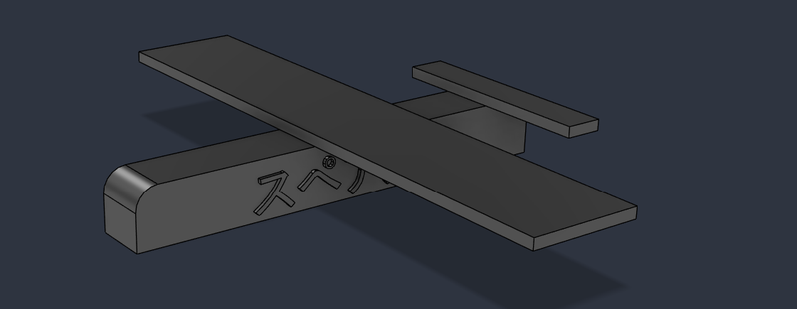

# 5. Autodesk Fusionの画面を知ろう

いきなり形を作る前に、まず**画面のどこに何があるか**、そして**今回使う3つの操作が何をするものか**を知っておきましょう。ここが分かっていないと、この後の指示(「ツールバーの◯◯を押して」など)が伝わりにくくなってしまいます。

## 5.1 画面の基本構成

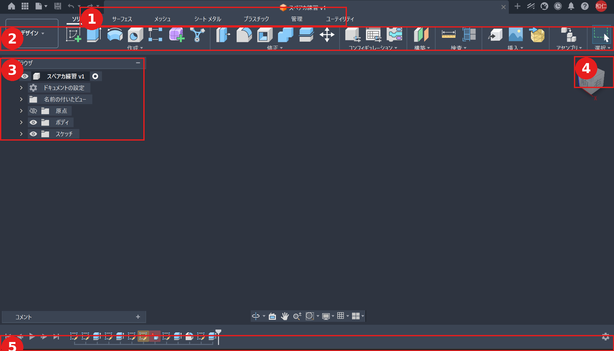

| 番号 | 場所 | 名前 | 役割 |
| --- | --- | --- | --- |
| ① | 画面上部のタブ | 作業スペースのタブ(ソリッド・サーフェス・メッシュ・シートメタル・プラスチックなど) | 使う機能のジャンルを切り替える。今日はずっと **「ソリッド」タブ** を使う |
| ② | タブの下の並び | ツールバー(作成・修正・構築など) | 実際に使う機能のボタンが並ぶ場所。**スケッチ・押し出し・フィレットもここから選ぶ** |
| ③ | 画面左側のツリー | ブラウザ | 「ボディ」「スケッチ」「原点」など、今まで作った要素の一覧。目のアイコンで表示/非表示を切り替えられる |
| ④ | 画面右上 | ナビゲーションキューブ | 視点をぐるぐる回すためのサイコロ型アイコン |
| ⑤ | 画面下部の帯 | タイムライン | 作業履歴。過去のアイコンをクリックすると、その時点の状態に戻せる |

> 💡 今日使う「スケッチ」「押し出し」「フィレット」は、すべて②のツールバーの **「作成」** または **「修正」** の中に入っています。迷ったら、まずこの2つのメニューを開いてみましょう。

視点の操作は、この3つだけ覚えておけば十分です。

| やりたいこと | 操作 |
| --- | --- |
| 視点を回転する | マウスホイールを押し込みながらドラッグ |
| 拡大・縮小する | マウスホイールを回す |
| 視点を移動する(パン) | `Shift` + ホイール押し込みドラッグ |

迷子になったら、④のナビゲーションキューブの近くにある **Fit** ボタンを押してください。モデル全体が画面にちょうど収まるように、視点が自動で戻ります。

操作を始める前に、この3つのショートカットも覚えておくと安心です。

- 元に戻す:`Ctrl + Z`(失敗しても戻せるので、怖がらず試してよい)
- 全体表示:ナビゲーションバーの **Fit**
- 保存:`Ctrl + S`(クラウドに自動保存されるが、名前だけは付けておく)

## 5.2 使う3つの操作

今回使う操作は、たった3つです。この3つの組み合わせだけで飛行機は作れます。

| 操作 | 何をするか | イメージ |
| --- | --- | --- |
| スケッチ | 平面の上に四角・円・文字を描く | 立体を作るための「設計図」を引く |
| 押し出し | 描いた形に厚みを付けて立体にする | 平らな図形が「ニョキッ」と立ち上がる。マイナスにすると穴が掘れる |
| フィレット | 角(辺)を丸くする | とがった箱が一気に「製品っぽく」なる |

## 5.3 練習:角を取った立方体を作ってみよう

いきなり飛行機を作る前に、この3つの操作だけを使った簡単な練習をしてみましょう。

1. **スケッチを作成**し、好きな平面を選ぶ
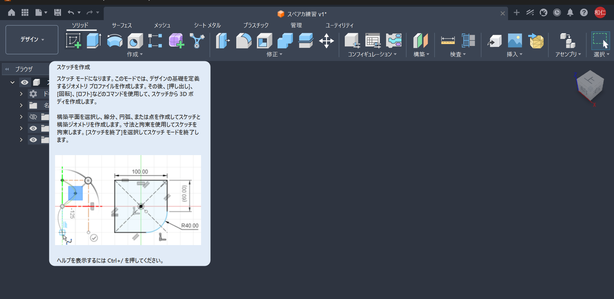
2. **中心矩形**で `40 × 40 mm` の正方形を描く
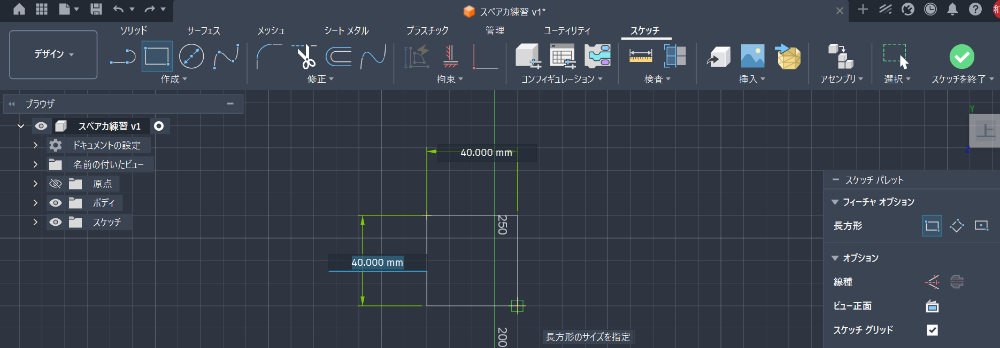
3. スケッチを終了し、**押し出し** で `40 mm`(立方体になります)
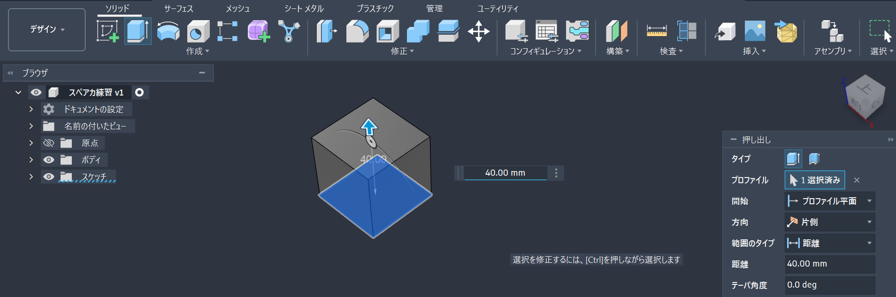
4. 縦の4辺を選び、**フィレット** で `R5` を付ける
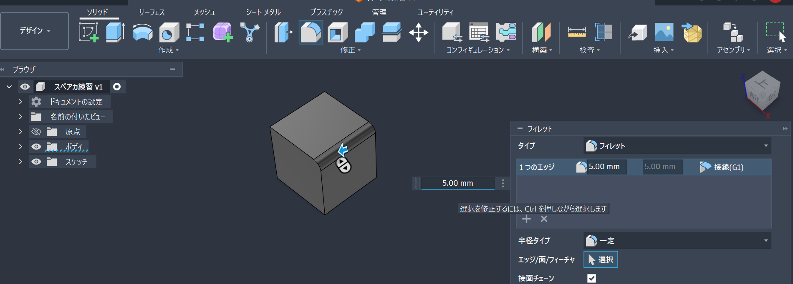

これで「スケッチ → 押し出し → フィレット」の一連の流れが体験できます。この後の機体づくりは、基本的にこの繰り返しです。

---

# 6. 機体を作る(ハンズオン)

数字はあくまで目安です。少しズレても飛行機は成立します。まずは手を動かしてみましょう。

## 6.1 STEP 1:胴体(ボディ)

1. **スケッチを作成**し、底の平面を選びます(以降、迷ったら毎回この平面を使ってください)
2. **中心矩形**で `120 × 16 mm` の長方形を描きます
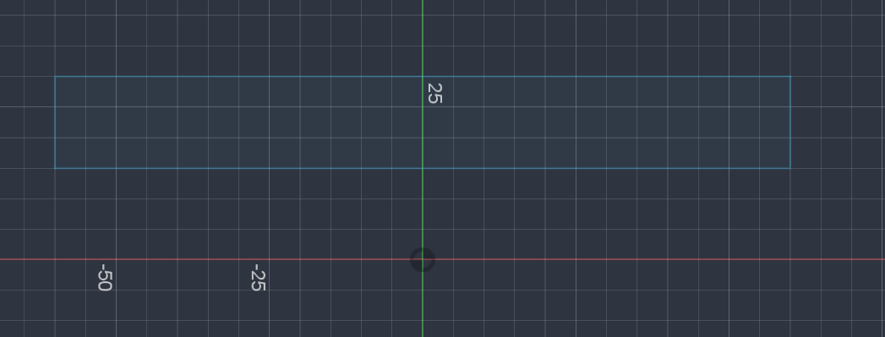
3. スケッチを終了し、**押し出し** で `16 mm`
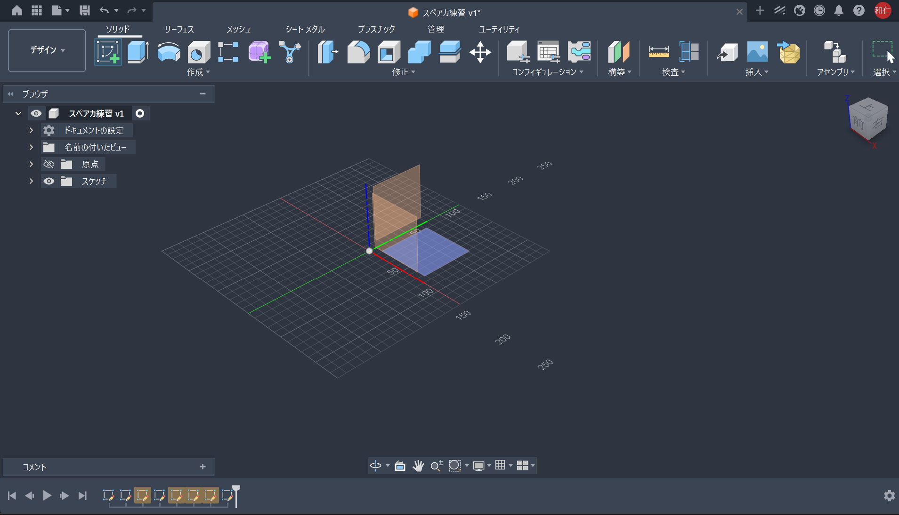

細長い箱ができれば、胴体の完成です。

## 6.2 STEP 2:主翼(ウイング)

来週の主役です。ここは丁寧に。

1. 胴体の**上面**に新しいスケッチを作成します
2. 胴体をまたぐように、中央あたりに `160 × 30 mm` の長方形を描きます
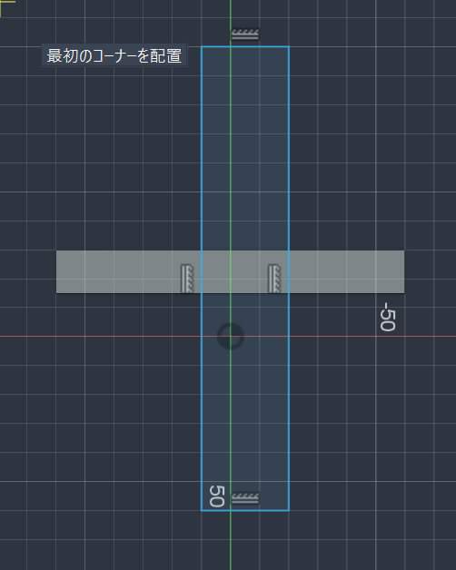
3. **押し出し** で `3 mm`
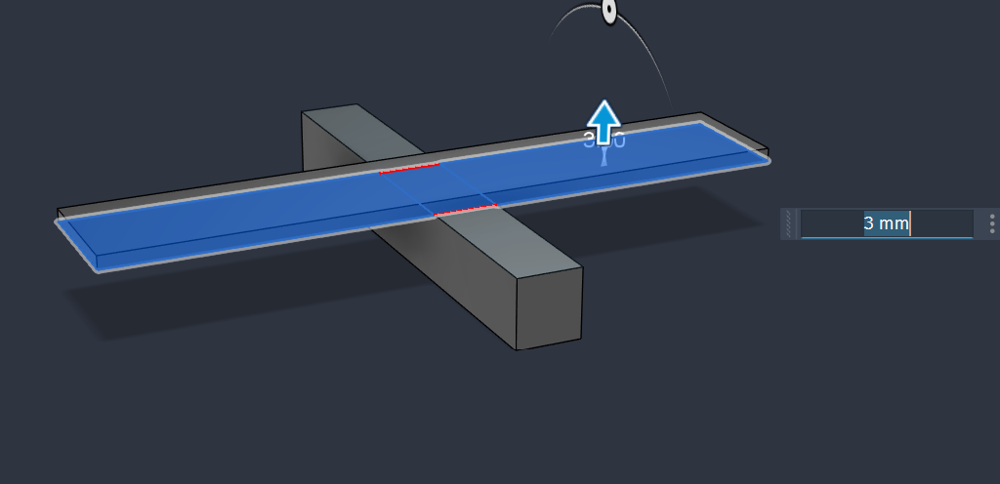

胴体を貫くように、左右の翼が一枚の薄い板として出来上がります。この「薄い板が根元から飛び出している」形が、先ほどの片持ち梁そのものです。

## 6.3 STEP 3:水平尾翼(テール)

1. 胴体後方の上面にスケッチを作成します
2. `60 × 16 mm` の長方形を描きます
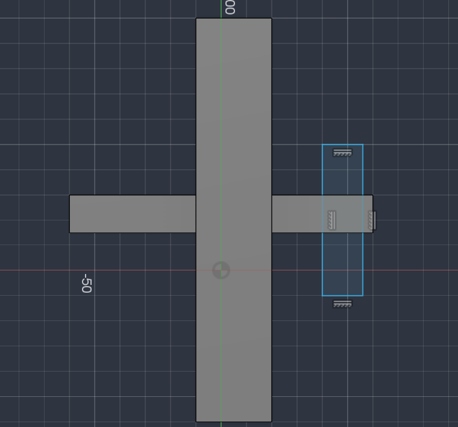
3. **押し出し** で `3 mm`

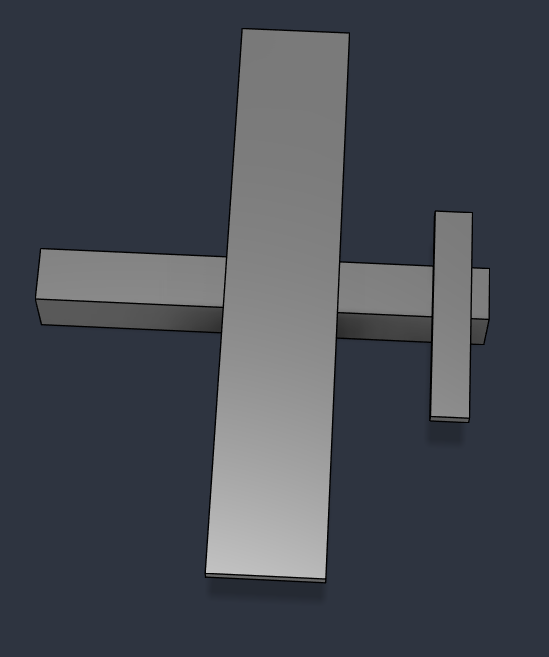

小さな翼がお尻に付き、ぐっと飛行機らしくなります。

## 6.4 STEP 4:機首を丸くする(フィレット)

- 胴体前方の**角(辺)**を選び、**フィレット** で `R6` を付けます
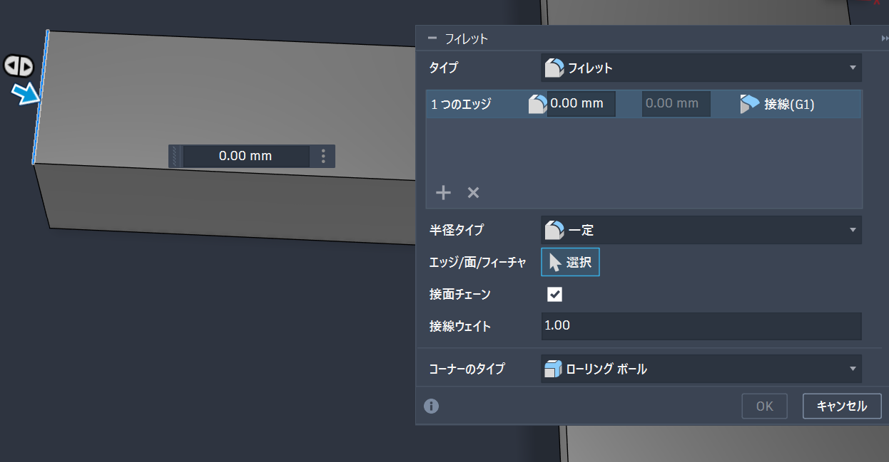
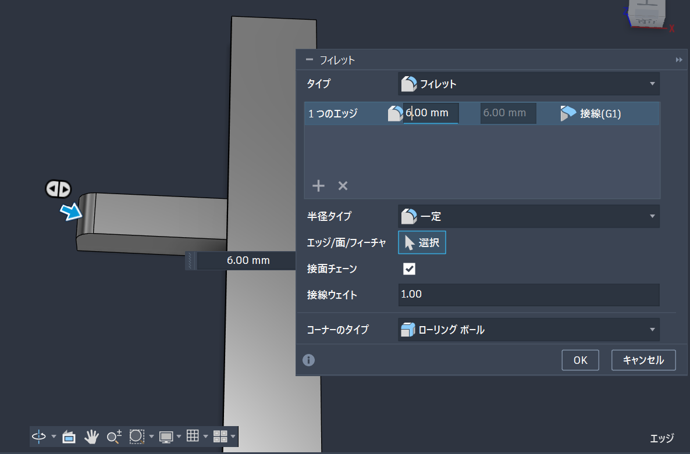
- ポイントは、面ではなく「辺(エッジ)」をクリックすることです

とがっていた鼻先が、まるい機首になります。

## 6.5 STEP 5:名前を刻む

1. 胴体の**側面**にスケッチを作成し、**テキスト**で自分の名前や機体名を入力します
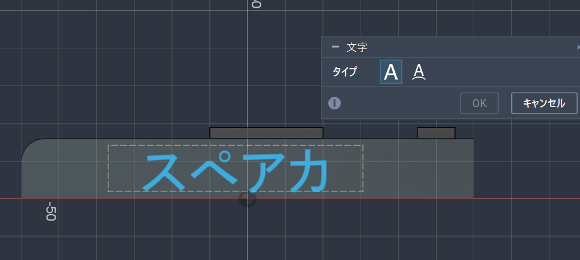
2. **押し出し** を**カット方向**にして `1 mm`(少しだけ掘る)
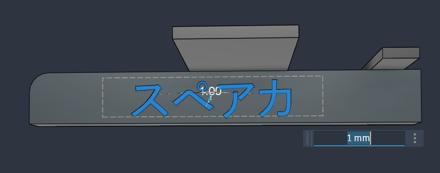

これで、世界に一機だけのあなたの機体になりました。**ここまで作れれば、今日は合格です。**

## 6.6 発展:自由に装飾する

時間が余ったら、好きなだけ盛りましょう。正解はありません。

- 垂直尾翼:お尻に薄い板を縦向きに立てる
- エンジン:翼の下に円柱(`φ8 × 20 mm`)を2つ付ける
- コックピット:胴体の上に小さな箱やドームを乗せる
- 色・素材を変える:**アピアランス**から色や金属をドラッグ＆ドロップする(最も手軽に見た目が変わります)
- 軽量化:シェルで内部をくり抜く

# 7. 作業時の注意

- **こまめに保存する**(`Ctrl + S`)。特に大きな操作の前後で保存しておくと、失敗しても戻れます。
- 装飾を盛りすぎると動作が重くなることがあります。実験的な操作の前には保存しておきましょう。
- 寸法は目安です。神経質にならず、まずは形にすることを優先しましょう。

# 8. よくあるつまずきと対処

| 症状 | 原因 | 対処 |
| --- | --- | --- |
| 押し出せない・面が選べない | スケッチの輪郭が閉じていない | 線が繋がっているか確認し、開いた端点を閉じる |
| フィレットで辺が選べない | 面をクリックしている | 面ではなく「辺(エッジ)」をクリックする |
| 寸法が入力できない | 入力方法・単位 | `Tab` キーで数値入力に切り替え、単位が mm か確認 |
| 視点が回りすぎて迷子になる | 操作しすぎ | ナビゲーションキューブの家アイコン → **Fit** で戻る |
| 色が変わらない | 適用先のミス | ボディ全体にアピアランスをドラッグできているか確認 |

# 9. 課題

1. **わざと弱い翼を作ってみよう。** 主翼の厚みを `1 mm` にした機体と `5 mm` にした機体を、それぞれ別ファイルで作ってみましょう。次章の構造解析で、どちらの翼がよく曲がる(折れやすい)と思いますか。理由も考えてみてください。
2. **自分の機体を説明できるようにしよう。** 機体に名前を付け、「ここがこだわり」というポイントを一つ、人に説明できるようにしておきましょう。
3. **(発展)実物から学ぼう。** 実際の飛行機の翼を調べ、なぜ根元が太く先端が細いのか、今回学んだ片持ち梁の観点から考察してみましょう。

# 10. 参考

- <https://www.autodesk.com/products/fusion-360/personal>
- <https://help.autodesk.com/view/fusion360/JPN/>(Autodesk Fusion 公式ヘルプ・チュートリアル)
- <https://www.autodesk.com/certification/learn>(Autodesk の学習コンテンツ)