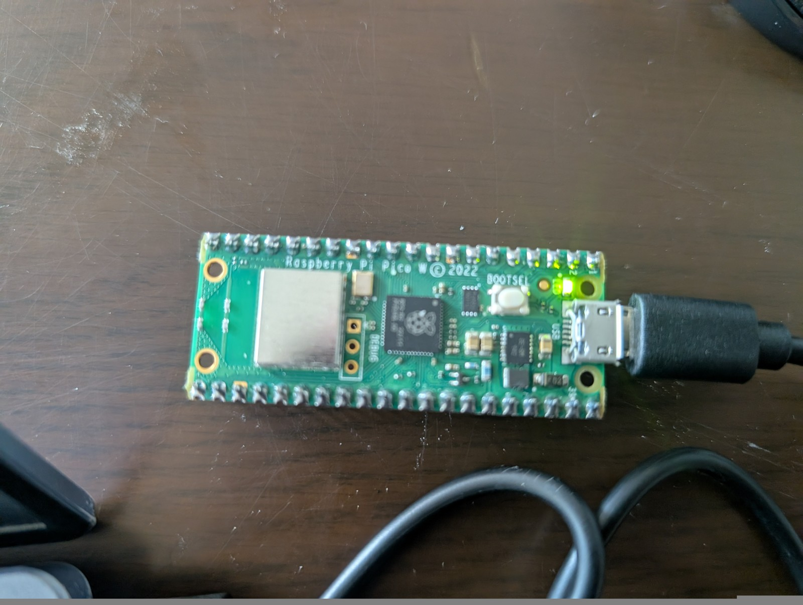
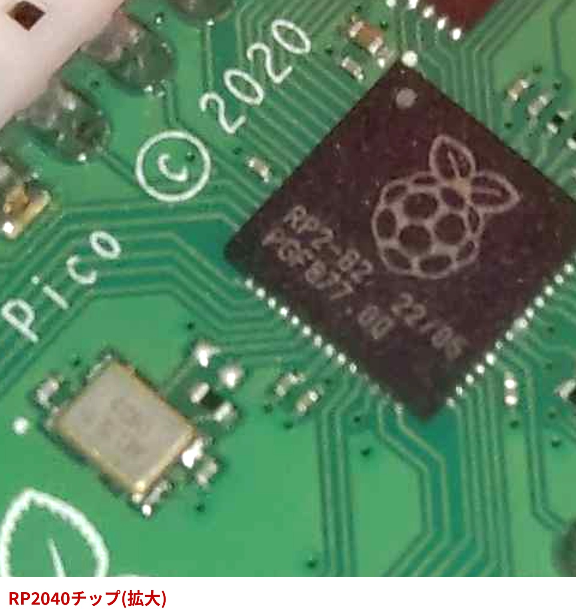
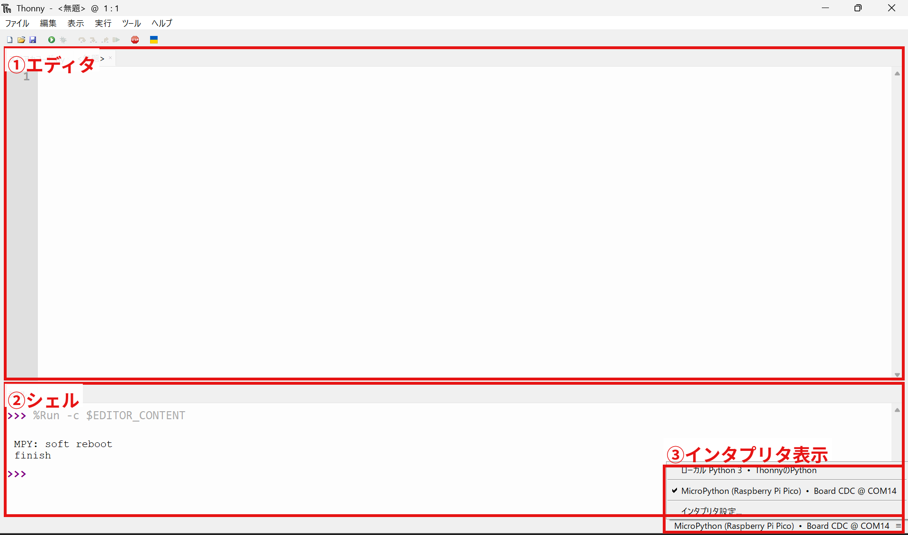
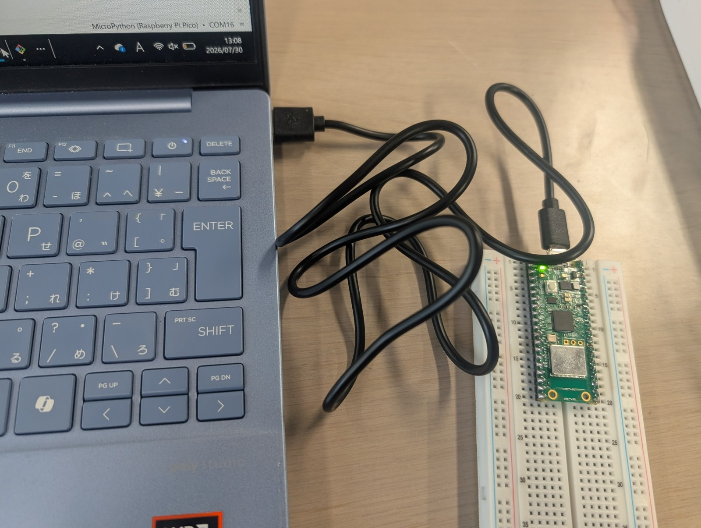
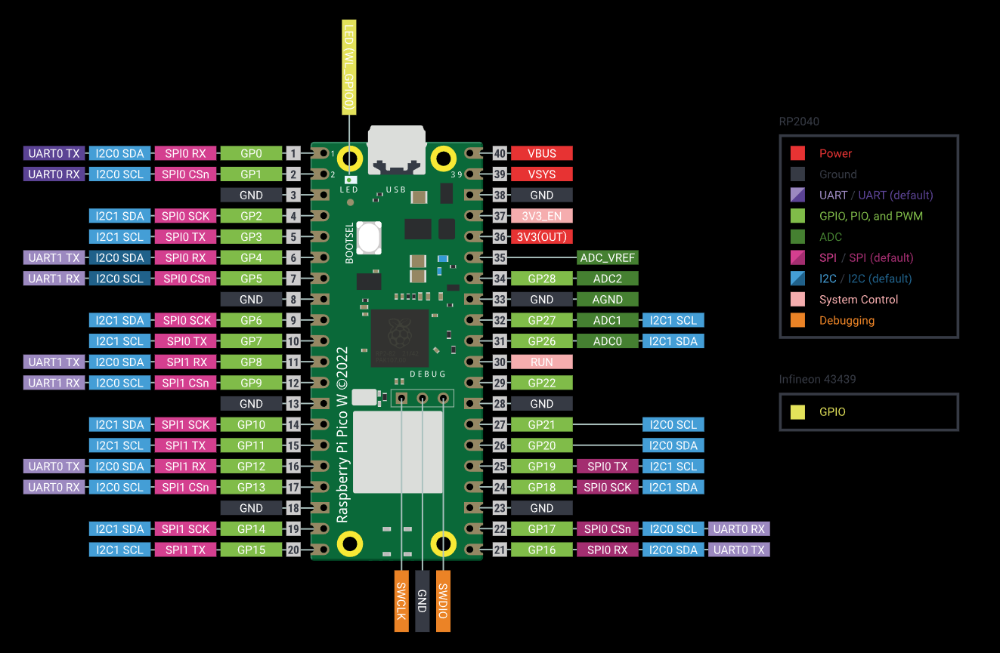
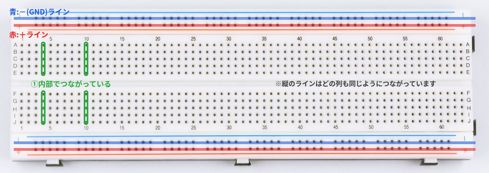
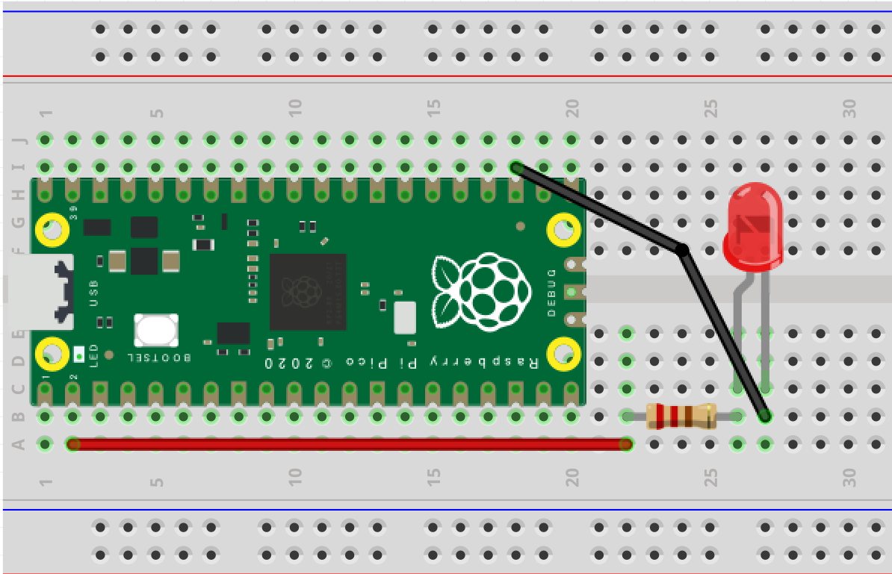
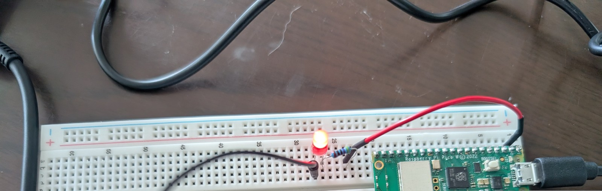
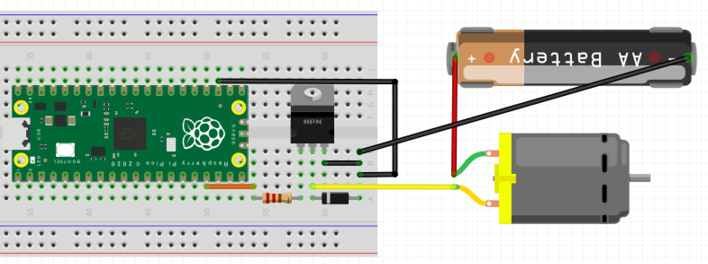
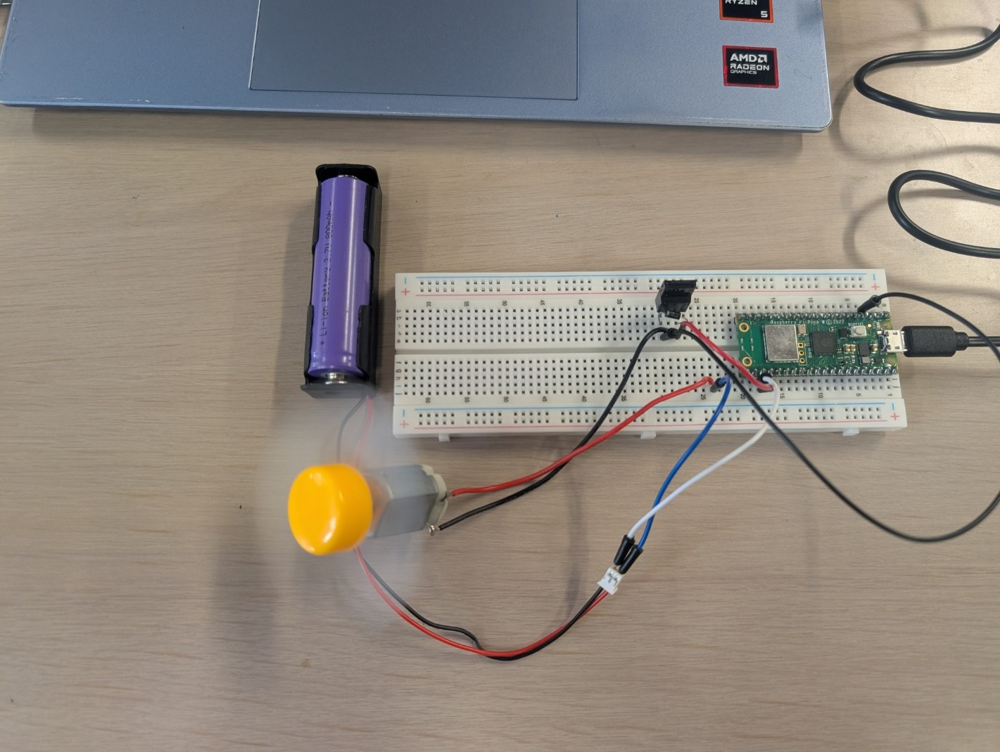

# 電子工作 第1回 マイコン入門・Lチカ・モーターを回す

前回までの環境構築([03_電子工作の環境構築.md](./03_電子工作の環境構築.md))で、ThonnyとRaspberry Pi Pico Wが会話できる状態になりました。今回はいよいよ、実際にマイコンを動かします。

今日、3つのことができるようになります。

1. マイコン(Raspberry Pi Pico W)に載っているLEDを、プログラムで点滅させる

2. ブレッドボードに自分で配線したLEDを点滅させる
3. LEDと同じ考え方で、モーターを回す

<table>
<tr>
<td width="25%"><br>①オンボードLEDが点滅している様子</td>
<td width="25%"><br>②ブレッドボード上のLEDが点灯している様子</td>
<td width="25%"><br>③モーターが回転している様子</td>

</tr>
</table>


> **今回のマインドセット**
> - 難しい理屈は後回し。まず「動いた」を体験する
> - 最初のオンボードLチカは、講師の画面を見ながら一緒に進める。自分でコードを書き換えるのはブレッドボードからでOK
> - 配線は不安になって当然。分からなければ遠慮なく質問する

## マイコンとは

**マイコン(マイクロコントローラ)**は、1つのチップの中にCPU・メモリ・入出力回路がまとまった、小さなコンピュータです。今日使うRaspberry Pi Pico Wも、皆さんのPCと同じように「プログラムを実行できる機械」ですが、PCよりずっと小さく安く、LEDやモーターのような部品を直接つなげるための足(**GPIO**)がたくさん生えているのが特徴です。

このGPIO(General Purpose Input Output:汎用入出力)を、プログラムで「電圧を出す/出さない」と切り替えることで、LEDを光らせたりモーターを回したりできます。今日はこの一番シンプルな操作を体験します。

基板の中央にある黒い四角いチップが、まさにこの「1つのチップにまとまったコンピュータ」の正体です。



> 💡 マイコンボードにはRaspberry Pi Pico Wの他にも、Arduino・STM32 Nucleo・ESP32など様々な種類があります。中に載っているチップ(Raspberry Pi Pico Wの場合はRP2040)がそのボードの性能を決めています。

---

## 1. マイコンLチカ(オンボードLEDだけで完結)

まずは配線なしで、Raspberry Pi Pico W基板に既についているLEDを光らせます。

### 1.1 Thonnyの画面を確認する

Thonnyの画面は大きく2つに分かれています。



| 番号 | 場所 | 名前 | 役割 |
| --- | --- | --- | --- |
| ① | 画面上部 | エディタ | プログラムを書く場所 |
| ② | 画面下部 | シェル | 実行結果や、直接コマンドを打てる場所 |
| ③ | 画面右下 | インタプリタ表示 | 現在接続中のボード・ポートを表示する |
| - | 画面左上の緑色の▶ | 実行ボタン | エディタに書いたプログラムをRaspberry Pi Pico Wへ送って実行する |

### 1.2 Raspberry Pi Pico Wを接続する

microUSBケーブルでRaspberry Pi Pico WをPCに接続します(BOOTSELを押す必要はありません。前回の環境構築で一度MicroPythonを書き込んだあとは、普通に挿すだけで認識されます)。



右下のインタプリタ表示が「MicroPython (Raspberry Pi Pico)」になっていれば準備完了です。

### 1.3 プログラムを見てみよう

まずは講師が画面を見せながら、次のコードをエディタに入力し、実行するところを見てもらいます。

```py
from machine import Pin
import time

led = Pin("LED", Pin.OUT)

for i in range(5):
    led.value(1)  # LED ON
    time.sleep(0.5)
    led.value(0)  # LED OFF
    time.sleep(0.5)

print("finish")
```

エディタに入力できたら、緑色の▶ボタンで実行します。LEDが0.5秒間隔で5回点滅すれば成功です。おめでとうございます、これがいわゆる**「Lチカ」**です。


### 1.4 ピンアサインを見てみよう

Lチカができたところで、Raspberry Pi Pico Wの基板を眺めてみましょう。基板の周りには小さな数字が書かれており、これが**GPIOのピン番号**です。



先ほどのコードの`Pin("LED", Pin.OUT)`の部分を、もし`Pin(25, Pin.OUT)`のように**番号を指定する書き方**に変えたら、今度は`"LED"`という特別な名前ではなく、**25番のピン(GP25)を直接指定して**同じオンボードLEDを光らせることになります。ピンアサイン図を見ると、USBコネクタのすぐ横に「LED (GP25)」と書かれているのが確認できると思います。

では、この`25`という数字を、たとえば`15`のように別の番号に変えたらどうなるでしょうか。「コードの中の数字を変えると、電圧が出てくる場所(足)が変わる」ということを、次のブレッドボードの実践で確かめてみましょう。

---

## 2. ブレボLチカ(ブレッドボード回路)

ここからは、実際に部品を配線して、自分で選んだGPIOピンからLEDを光らせます。

### 2.1 ブレッドボードとジャンパワイヤ

**ブレッドボード**は、はんだ付けをせずに部品同士をつなげる板です。



| 番号 | 場所 | つながり方 |
| --- | --- | --- |
| ① | 中央部の縦5穴 | 内部で電気的につながっている(1本の線と同じ) |
| ② | 上下の電源ライン(赤線側・青線側) | 横方向に長くつながっている(電源とGNDの配布用) |

**ジャンパワイヤ**は、ブレッドボードの穴同士や、ブレッドボードとRaspberry Pi Pico Wのピンをつなぐための線です。オス-オス(両端が細い針状)のものを使います。

### 2.2 準備するもの

- Raspberry Pi Pico W
- ブレッドボード
- ジャンパワイヤ
- LED(赤)
- 抵抗(3.3kΩ程度)

### 2.3 配線する

次の配線図の通りに、LEDと抵抗を配線します。LEDの長い足(アノード)を抵抗経由でGPIOへ、短い足(カソード)をGNDへつなぎます。



> 💡 抵抗を挟む理由:LEDは電流が流れすぎると壊れてしまいます。抵抗を直列に入れることで、流れる電流を安全な範囲に制限しています。

### 2.4 プログラムの数字を自分で変えてみよう

先ほどのオンボードLチカのコードを元に、GPIOの番号を指定する書き方に直します。**自分が配線した番号に合わせて、数字を書き換えてみてください。**

```py
from machine import Pin
import time

led = Pin(1, Pin.OUT)  # ← 自分の配線に合わせて番号を変えてみよう

for i in range(5):
    led.value(1)  # LED ON
    time.sleep(0.5)
    led.value(0)  # LED OFF
    time.sleep(0.5)

print("finish")
```

配線したGPIO番号と、コード中の数字が一致していれば、ブレッドボード上のLEDが点滅します。試しに違う番号に変えて実行し、光らなくなることも確認してみましょう(「番号=物理的な足の位置」という感覚を掴むための実験です)。



---

## 3. モータを回す

LEDが光らせられるようになったところで、同じ考え方で**モーター**を回してみます。

### 3.1 マイコンとモーターの電力の違い

マイコンのGPIOが流せる電流は、数mA〜数十mA程度とごくわずかです。一方モーターを回すには、数百mA〜数A程度の電流が必要になります。もしGPIOに直接モーターをつなぐと、マイコンの回路が壊れてしまいます。

| | 流せる/必要な電流 |
| --- | --- |
| マイコンのGPIO | 数mA〜数十mA |
| モーター | 数百mA〜数A |

つまり、**マイコンの回路(小さな電流)とモーターの回路(大きな電流)は、そのままではつなげられない**ということです。

### 3.2 MOSFETという「電気で動くスイッチ」

そこで使うのが**MOSFET**という部品です。原理の詳しい説明は今日は省きますが、役割はシンプルです。

> GPIOからの小さな電圧(信号)を受け取ると、モーター側の大きな電流を流すか止めるかを切り替えてくれる、**電気で操作できるスイッチ**

つまり、GPIOは直接モーターを動かすのではなく、「モーターの電源を入れる/切るスイッチ」をON/OFFしているだけ、というイメージです。


### 3.3 準備するもの

- Nch MOSFET
- DCモーター
- 整流ダイオード
- 電池(9V程度)・バッテリースナップ

### 3.4 配線する

次の配線図の通りに配線します。MOSFETのゲートをGPIOへ、ドレイン・ソースにモーターと電池を接続します。モーターと並列にダイオードを逆向きに接続します(モーターが止まる瞬間に発生する電圧からMOSFETを守るためのものです)。



> 💡 この図はRaspberry Pi Pico(無印)の部品でFritzing作図されていますが、**Pico WはPicoと基板・GPIOピン配列が共通**なので、この配線パターンはそのまま使えます(Pico Wだけの特別なピン(オンボードLEDや無線チップ用のGPIO23・24・25・29)を使っていなければ問題ありません)。図中でGPIOがどのピンに繋がっているかは、前節のピンアサイン図と照らし合わせて自分の目で確認し、コード中の`Pin(13, ...)`の`13`をその番号に合わせてください。


### 3.5 プログラムはそのまま使う

ここが今日いちばん大事なポイントです。**プログラムは、先ほどのLED点滅のものを一切変更しません。** GPIOの番号だけ、配線した場所に合わせてください。

```py
from machine import Pin
import time

gate = Pin(13, Pin.OUT)  # 配線したGPIO番号に合わせる

for i in range(3):
    gate.value(1)  # モーターON
    time.sleep(2)
    gate.value(0)  # モーターOFF
    time.sleep(2)

print("finish")
```

`led`という変数名が`gate`に変わっただけで、`value(1)/value(0)`という操作は全く同じです。モーターが2秒おきに3回、回っては止まることを確認してください。



**LEDもモーターも、マイコンから見れば「GPIOをONにするかOFFにするか」という同じ操作だった**、ということが今日のいちばんの発見です。

---

## 4. 追加課題(早く終わった人向け)

作業が早く終わった人は、次のような発展に挑戦してみましょう。

- LEDの点滅間隔(`time.sleep()`の数値)を変えて、点滅の速さを変えてみる
- LEDをもう1個追加し、2つのLEDが交互に点滅するプログラムを書いてみる
- `print()`を使って、今何回目の点滅かをシェルに表示してみる(次回以降、通信やセンサの回でも`print()`をよく使います)

## 5. 宿題

> モーター・MOSFET・電池を1つの回路につなぐとき、これらをどの順番でつなぐのが正解でしょうか。それとも、つなぐ順番に決まりはないのでしょうか。今日の配線図を見返しながら、自分なりに考えてきてください。次回、みんなで答え合わせをします。

*(ここに考えるヒントとなる回路図・写真を貼る。`21_homework_hint.jpg`)*

## 6. 参考

- <https://www.raspberrypi.com/documentation/microcontrollers/raspberry-pi-pico.html>(Raspberry Pi Pico シリーズ公式ドキュメント)
- <https://micropython-docs-ja.readthedocs.io/ja/latest/library/index.html>(MicroPython日本語リファレンス)