# 電子工作 第2回 タクトスイッチとデジタル入力

前回([04_マイコン入門とLチカとモーター.md](./04_マイコン入門とLチカとモーター.md))は、マイコンからLEDやモーターへ一方的に指示を出す**出力(Output)**だけを扱いました。今回はその逆、マイコンが外の世界から情報を受け取る**入力(Input)**を体験します。

今日のゴールは、タクトスイッチ(ボタン)の状態を、マイコンが「押されている(High)」「押されていない(Low)」の2値で読み取れるようになることです。

> **今回のマインドセット**
> - 最初にわざと「うまくいかない配線」を試します。失敗を恐れずに観察してください
> - 「あれ、おかしいぞ?」と思ったその感覚が、今日いちばん大事な入り口です
> - 理屈(プルアップ・プルダウン)は、うまくいかない現象を見たあとに理解した方が圧倒的に早いです

## 1. 準備するもの

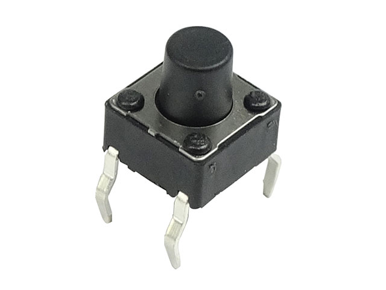

- Raspberry Pi Pico W
- ブレッドボード・ジャンパワイヤ
- タクトスイッチ

## 2. タクトスイッチの中身を覗いてみよう

配線を始める前に、この部品の中で何が起きているかを知っておきましょう。タクトスイッチには4本の足がありますが、実は**2本×2組のペア**でしかありません。

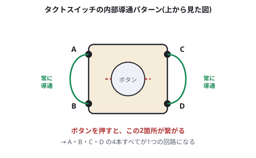

- 左側の2本(A・B)は、**押しても押さなくても常に内部でつながっている**
- 右側の2本(C・D)も同様に、**常に内部でつながっている**
- ボタンを**押すと**、この左ペアと右ペアの間が初めて接触し、A・B・C・D**すべてが1つの回路**としてつながる

つまりタクトスイッチは、「4本足の部品」というより「2本足のスイッチが、配線しやすいように4本足に分かれているだけ」と考えると分かりやすいです。ブレッドボードに挿すときは、**どの足とどの足が対になっているか(同じ辺の2本)**を意識して、正しいペアを使うようにしてください(隣り合う2本ではなく対角の2本を使ってしまうと、押しても常に同じペアのままで反応しないので注意)。

## 3. まず「プル無し」で配線してみる

タクトスイッチの片方をGPIO16へ、もう片方をGND(またはVCC)へ、**それ以外は何もつながずに**配線します。

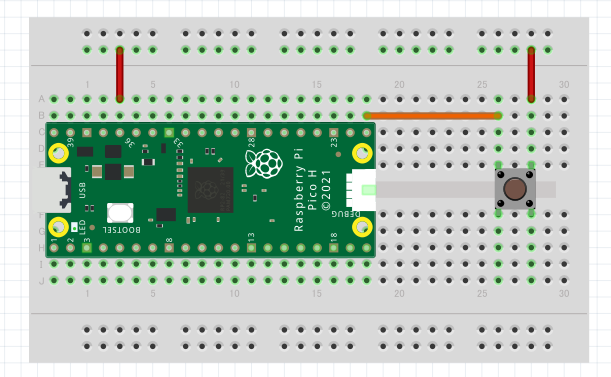

> 💡 この図はRaspberry Pi Pico(無印)の部品でFritzing作図されていますが、Pico Wと基板・GPIOピン配列は共通なので、そのまま使えます。

配線できたら、次のプログラムをThonnyで実行します。

```py
from machine import Pin
import time

pin = Pin(16, Pin.IN)

while True:
    val = pin.value()
    print("INPUT:", val)
    time.sleep(0.2)
```

### シェルとグラフ、両方で観察しよう

Thonny下部の「シェル」には、実行結果がテキストで流れます。それに加えて、今日は**「プロッター(Plotter)」**という機能も使ってみましょう。数値の変化をリアルタイムの折れ線グラフとして見ることができます。

1. Thonnyのメニューから **表示(View) → プロッター(Plotter)** を選ぶ
2. 先ほどのプログラムを実行する
3. `print("INPUT:", val)`のように出力された数値が、自動的にグラフとして描画されていく

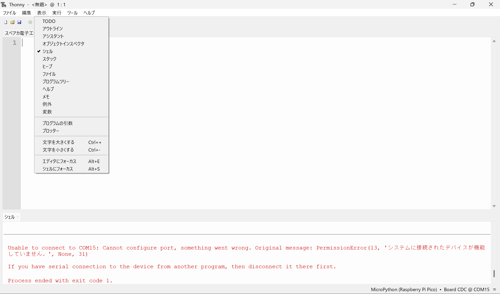

スイッチを**押さずに**しばらく様子を観察してください。

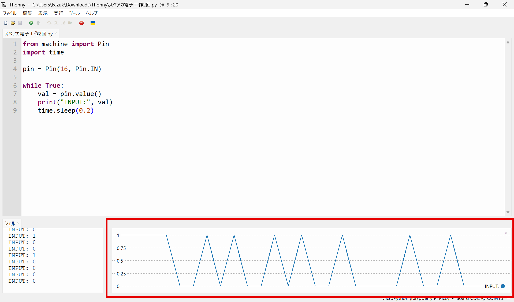

赤枠で囲った部分が**プロッター**のグラフです。スイッチに触れていないにもかかわらず、`INPUT`の値が0と1の間で不規則に上下し、三角波のようなノイズが継続的に発生しています。これが「浮遊(フローティング)」状態特有の、電圧が定まらない挙動です。

### うまく不安定にならなかったら

理屈のうえでは、この配線は「電圧が定まらない(不安定)」はずです。しかし実際にブレッドボードで試すと、**押していないのに妙に安定して0(または1)のまま動かない**ことがよくあります。これは配線ミスではありません。

「浮遊(フローティング)」とは、電圧が**「決まっていない(不定)」**という意味であって、「必ず激しく振動する」という意味ではありません。宙ぶらりんの線は、その時々のわずかな電荷をたまたま保持し続け、静かな環境では偶然「安定して見える」こともあるのです。

これを確かめるために、**わざと電位を揺らす実験**をしてみましょう。

1. GPIOにつながっている、**どこにもつながっていない側のジャンパワイヤの先端**を、指で軽く触れてみる
2. 体を通して伝わる微弱なノイズ(周囲の電化製品や配線が拾う商用電源の周波数など)が線に乗り、グラフが激しく暴れるはずです
3. 手を離すと、また元の「たまたま安定した値」に戻ります

*(ここに指でジャンパワイヤの先端に触れてグラフが乱れる様子のスクリーンショットまたは写真を貼る。12_finger_touch_floating.jpg ※該当する写真が未アップロードのため要追加)*

> 💡 それでも安定して見える場合は、ジャンパワイヤをもう1本継ぎ足して線を長くしてみましょう。線が長いほどノイズを拾いやすくなり(アンテナのような役割)、不安定さが目立ちやすくなります。

**指で触れただけで値が変わってしまう**ということ自体が、「この配線では電圧が何によっても決まっていない」ことの何よりの証拠です。次の章で、なぜこうなるのかを説明します。

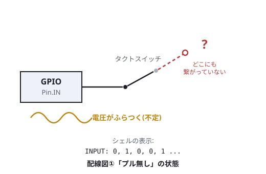

## 4. なぜこうなるのか:浮遊(フローティング)

先ほどの配線を図にすると、上のようになります。GPIOにつながる線は、**スイッチを経由してもどこにも行き着いていません**(スイッチが開いている間、その先は宙ぶらりんの状態です)。

このように、電源(VCC)にもGND(0V)にも接続されていない状態を**「浮遊(フローティング)」**と呼びます。浮遊状態の入力ピンは、何によっても電圧が決められていないため、指で触れる・線を伸ばすといったごくわずかな外乱で電圧が変わってしまいます。

これを防ぐには、**「何もしていないときの電圧を、あらかじめどちらかに決めておく」**必要があります。次の章で、実際にこれを解決します。

## 5. プルダウン抵抗で解決する

先ほどの配線に、**抵抗を1本追加**します。スイッチとGPIOの分岐点から、抵抗を経由してGNDへつなぎます。

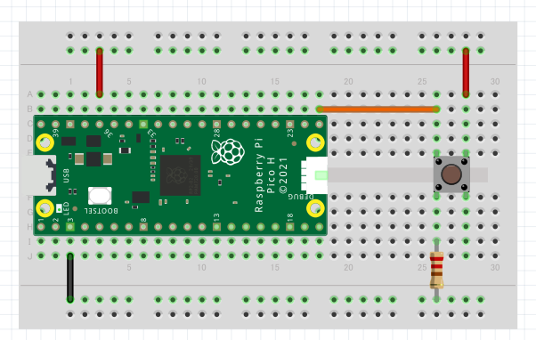

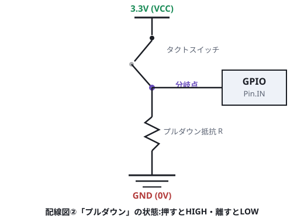

この抵抗を**「プルダウン抵抗」**と呼びます。役割はシンプルです。

- スイッチが**押されていない**とき:GPIOは抵抗を通じてGNDに引っ張られ、電圧は**0V(Low)** に安定する
- スイッチが**押されている**とき:GPIOは電源側に直接つながり、電圧は**High** になる

同じプログラムを、配線を直しただけの状態で再実行してみてください(**プロッター**も表示したままにしておきましょう)。

```py
from machine import Pin
import time

pin = Pin(16, Pin.IN)

while True:
    val = pin.value()
    print("INPUT:", val)
    time.sleep(0.2)
```

今度は、押していないときは`INPUT: 0`で安定し、押している間だけ`INPUT: 1`に変わるはずです。**プロッター**のグラフも、押すたびに0とHIGHの間をきれいに行き来する**四角い波形(矩形波)**になります。先ほどの「指で触れただけで暴れるグラフ」と見比べると、違いがよく分かると思います。

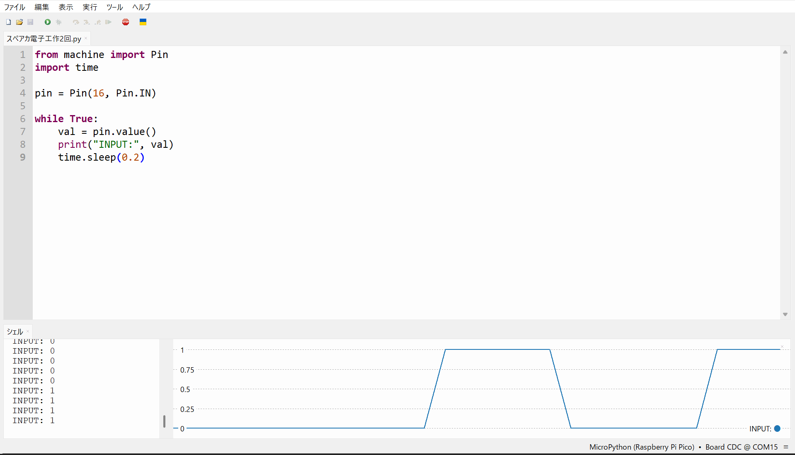

赤枠で囲った部分が**プロッター**のグラフです。プルダウン抵抗を追加したことで、ボタンを押していない間は`INPUT: 0`で水平にぴったり安定し、押している間だけ`INPUT: 1`に立ち上がる、きれいな矩形波(四角い波形)になっています。先ほどの不規則な波形と見比べると、電圧が明確に0とHighの2値で定まっていることがよく分かります。


> 💡 **プルアップという逆方式もある**
> 今回はプルダウン(押すとHigh)を使いましたが、世の中の製品では実は**プルアップ(押すとLow)** の方が多く使われています。
>
> 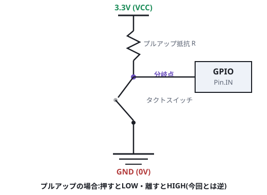
>
> なぜプルアップの方が主流なのか、今日の宿題で考えてみましょう。

> 💡 **マイコン内蔵のプル抵抗**
> 最近のマイコンは、プルアップ・プルダウン抵抗をチップの中に内蔵していることが多く、外付けの抵抗が無くてもコードだけで有効化できます。

```py
pin = Pin(16, Pin.IN, Pin.PULL_DOWN)  # 内蔵プルダウンを有効化
```

外付け抵抗を外し、この1行に書き換えて、同じように安定するか確かめてみましょう。

## 6. 確認課題

前回作ったLED(GPIO15)・モーター(GPIO13、MOSFET経由)の回路はそのまま使います。

1. **ボタンを押している間だけLEDを光らせる**プログラムを書いてみましょう。

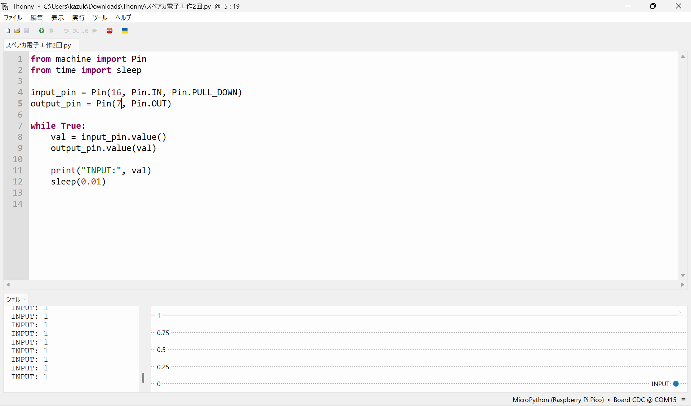

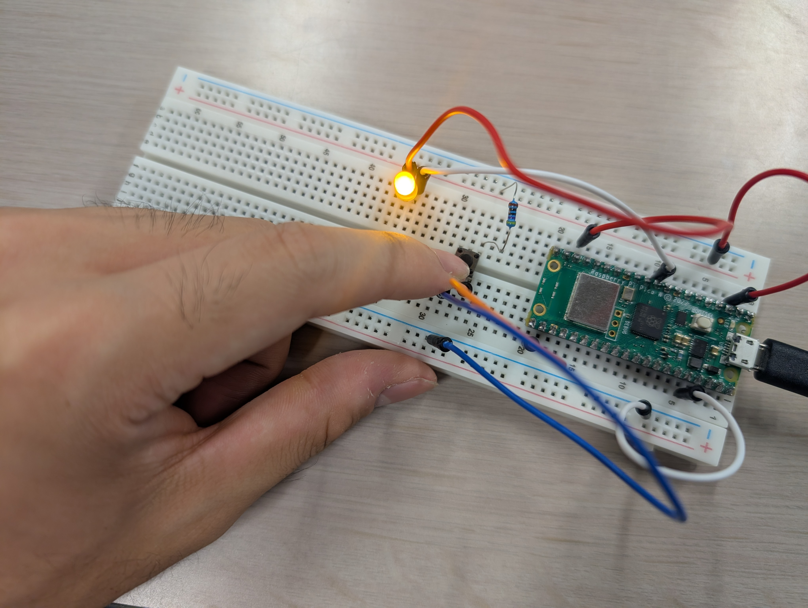

2. **ボタンを押している間だけモーターを回す**プログラムを書いてみましょう(配線・プログラムとも、LEDのものをほぼそのまま応用できるはずです)。

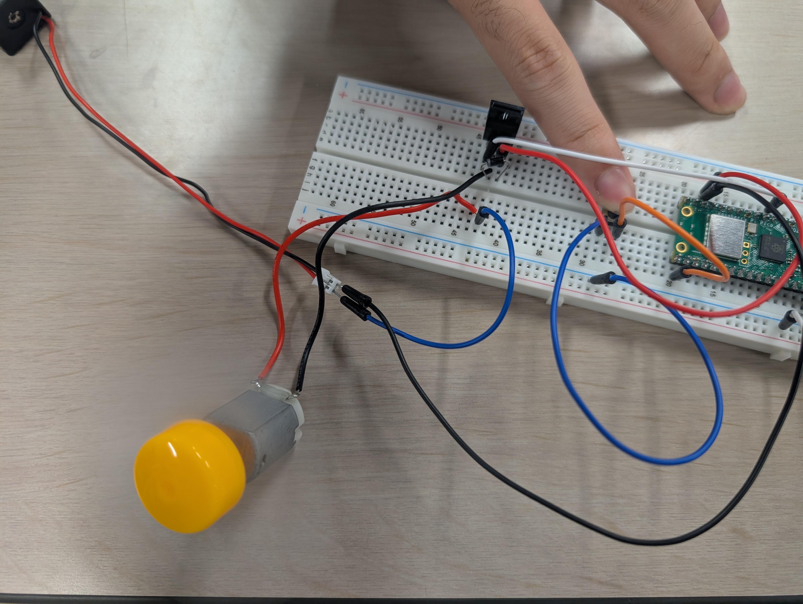

## 7. この「入力」は、この先どうつながるか

今日学んだ「GPIOの電圧をHigh/Lowの2値として読み取る」という仕組みは、実はタクトスイッチだけのものではありません。

- マイコン同士が通信するとき(次回以降で扱います)も、相手が送ってくる信号を、結局は同じように「電圧が高いか低いか」で読み取っています
- 一部のセンサ(たとえば物体を検知するフォトセンサなど)も、検知した/していないを同じHigh/Lowの信号としてマイコンに伝えるものがあります

つまり、今日体験した「入力を読む」という考え方は、**ボタンに限らず、マイコンが外の世界とやり取りする基本パターン**です。この後の講座で、通信やセンサの回が出てきたときに、今日の内容を思い出してみてください。

## 8. 宿題

> 今日はプルダウン(押すとHigh)方式を使いましたが、世の中の製品ではプルアップ(押すとLow)方式の方がよく使われています。なぜプルアップの方が主流なのか、自分なりに理由を考えてきてください。次回、みんなで答え合わせをします。

## 9. 参考

- <https://www.raspberrypi.com/documentation/microcontrollers/raspberry-pi-pico.html>(Raspberry Pi Pico シリーズ公式ドキュメント)
- <https://micropython-docs-ja.readthedocs.io/ja/latest/library/index.html>(MicroPython日本語リファレンス)
- <https://thonny.org/>(Thonny公式サイト。View → Plotterの詳細はヘルプメニューも参照)