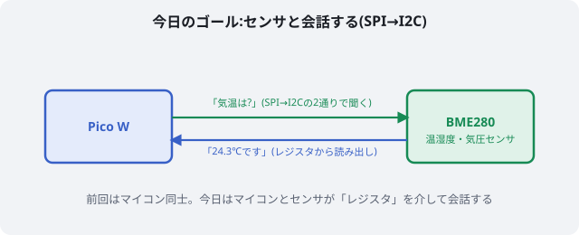
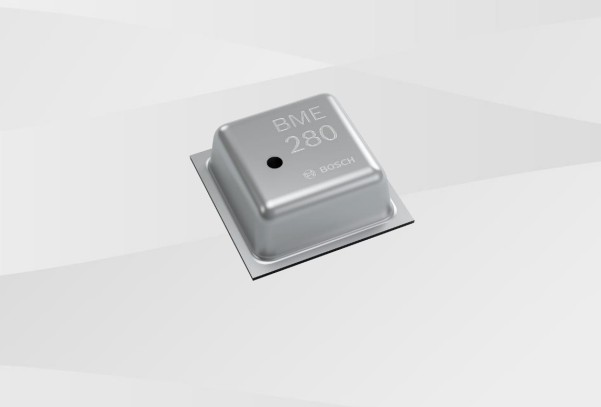
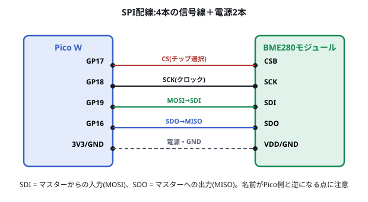
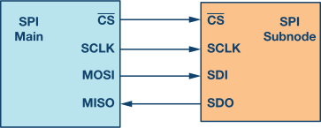
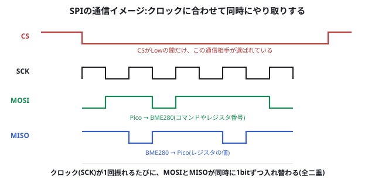
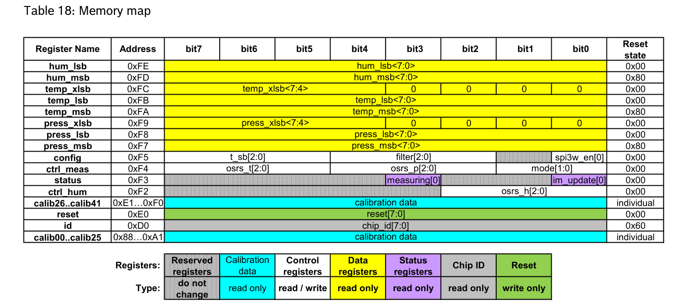
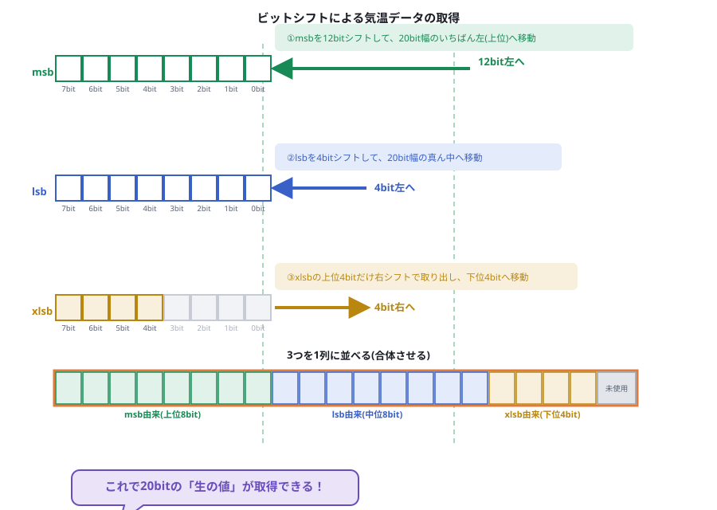
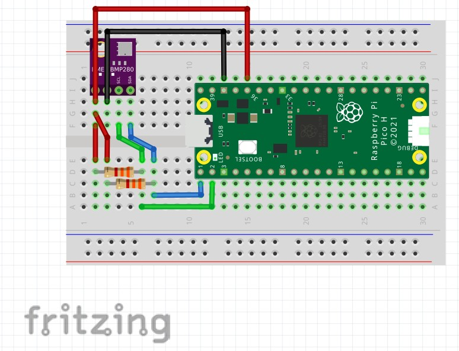
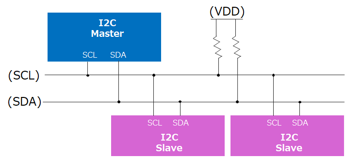
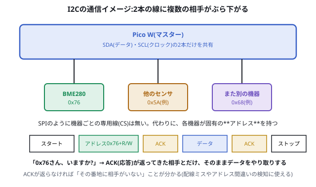

# 電子工作 第4回 I2CとSPIでセンサと話す

前回([05_UARTでマイコン同士を通信させる.md](./05_UARTでマイコン同士を通信させる.md))は、**マイコン同士**がUARTでおしゃべりしました。今日は初めて、**マイコンとセンサ**が会話します。相手が変わるだけでなく、会話の仕方(プロトコル)も新しく2つ、**SPI**と**I2C**を学びます。



> **今回のマインドセット**
> - 同じセンサに、まずSPIで、次にI2Cで話しかけます。「相手は同じなのに、話し方が2通りある」ことを体感してください
> - センサとの会話は、前回までの「0か1か」より一段階複雑です。難しく感じたら、いったん手を動かすことを優先しましょう

## 1. センサの仕組み(概念)

これまで扱ってきたLED・モーター・ボタンは、マイコンが直接電圧を出したり読んだりするだけの単純な相手でした。**センサは違います。**

センサの内部では、次のようなことが起きています。

1. センサが物理量(温度・湿度・気圧など)を測定する
2. 測定結果を、センサ内部の**小さなメモリ(レジスタ)**に数値として保存する
3. マイコンは、その**レジスタの中身を「読みに行く」**ことで、初めて値を受け取れる

つまりセンサとの通信とは、**「センサの中にある値を、決まった手順で読み出しに行く行為」**です。今日学ぶSPIとI2Cは、この「読みに行く手順(プロトコル)」の代表的な2つのやり方です。同じBME280というセンサに対して、話し方を変えて2回アクセスしてみましょう。

## 2. 準備するもの



- Raspberry Pi Pico W
- BME280モジュール(SPI/I2C両対応品。例:秋月電子 AE-BME280)
- ブレッドボード・ジャンパワイヤ

## 3. SPIで実践:まず値を取得する

### 配線する



| Pico W | BME280モジュール |
| --- | --- |
| GP17 | CSB |
| GP18 | SCK |
| GP19 | SDI |
| GP16 | SDO |
| 3V3・GND | VDD・GND |

> 💡 モジュール側の「SDI」「SDO」はセンサから見た入出力の名前です。Pico側の「MOSI(送信)」はSDIに、「MISO(受信)」はSDOにつながります。名前が逆になる組み合わせなので、配線時によく確認してください。

### ライブラリを用意する

MicroPython標準にはBME280用のライブラリが含まれていないため、SPI・I2C両方に対応したライブラリを追加します(例:`teddokano/BME280_MicroPython`など)。Thonnyのパッケージ管理機能、または`.py`ファイルを直接Pico Wへ書き込む方法でインストールしてください。

> ⚠️ ライブラリごとにクラス名や引数の書き方が異なることがあります。以下のコードは代表的な使い方の例です。**インストールしたライブラリのREADME/サンプルコードと照らし合わせて、必要に応じて書き換えてください。**

### コードを書き込む

```py
from machine import Pin, SPI
from bme280 import BME280  # インストールしたライブラリ名に合わせる
import time

cs = Pin(17, Pin.OUT)
spi = SPI(0, baudrate=1_000_000, sck=Pin(18), mosi=Pin(19), miso=Pin(16))

sensor = BME280(spi=spi, cs=cs)

while True:
    print(sensor.values)  # (気温, 気圧, 湿度) のようなタプルが返る想定
    time.sleep(1)
```

*(ここにシェルに気温・気圧・湿度が表示されている様子のスクリーンショットを貼る。`07_spi_result.png`)*

値が表示されたら成功です。**画面の向こうにあるセンサの中の数値を、SPIという手順で読み出せた**ことになります。

## 4. ソフトウェア/センサの仕組み解説

先ほど「動いた」ことを、ここで種明かししていきます。

### 4.1 SPIの原理

SPIは4本の信号線を使う通信方式です。まずは全体のつながり方(トポロジー)を見てみましょう。



マスター側は「CS・SCLK・MOSI・MISO」、センサ側は「CS・SCLK・SDI・SDO」と呼び方が変わりますが、対応する信号同士(CS↔CS、SCLK↔SCLK、MOSI↔SDI、MISO↔SDO)をつなぐだけです。矢印の向きに注目すると、CS・SCLK・MOSIはマスターからセンサへ、MISOだけがセンサからマスターへ向かっていることが分かります。



| 線 | 役割 |
| --- | --- |
| SCK(クロック) | マスター(Pico)が刻む、通信のリズム |
| MOSI(Master Out Slave In) | マスターからセンサへ送るデータ(コマンドやレジスタ番号) |
| MISO(Master In Slave Out) | センサからマスターへ返るデータ(レジスタの値) |
| CS(チップセレクト) | 「今からあなたと話します」という合図。Lowにしている間だけ相手として選ばれる |

前回学んだUARTとの大きな違いは、**クロック線(SCK)がある**ことです。UARTは「スタートビット+事前に決めた速度」で足並みを揃えましたが、SPIは**クロックが刻まれるたびに1bitずつ、送信と受信を同時に**行います(全二重)。クロックがある分、UARTよりも高速かつ正確に通信できます。

CSは、1本のSCK/MOSI/MISOを複数のセンサで共有しつつ、**「今はこのCSがLowになっている相手とだけ話す」**ことで、混線せずに複数の機器を扱えるようにする仕組みです。

### 4.2 レジスタマップとデータシートの対応

先ほどのコードで、ライブラリは実際には何をしていたのでしょうか。BME280のデータシートには、次のような**レジスタマップ**(番地ごとに何が書かれているかの一覧表)が載っています。

| アドレス | レジスタ名 | 内容 |
| --- | --- | --- |
| 0xD0 | id | チップIDの確認用(固定値`0x60`が読める) |
| 0xF2 | ctrl_hum | 湿度の測定モード設定 |
| 0xF4 | ctrl_meas | 気温・気圧の測定モード設定 |
| 0xF7 | press_msb | 気圧データ(上位byte) |
| 0xF8 | press_lsb | 気圧データ(中位byte) |
| 0xF9 | press_xlsb | 気圧データ(下位byte) |
| 0xFA | temp_msb | 気温データ(上位byte) |
| 0xFB | temp_lsb | 気温データ(中位byte) |
| 0xFC | temp_xlsb | 気温データ(下位byte) |
| 0xFD | hum_msb | 湿度データ(上位byte) |
| 0xFE | hum_lsb | 湿度データ(下位byte) |

上の表は分かりやすいように私たちが書き直したものですが、**Bosch社が公開している本物のBME280データシート(Table 18: Memory map)には、次のような形でレジスタマップが載っています。**



一見ぎっしりして難しそうに見えますが、見るべきところは同じです。左の**「Register Name」**が名前(press_msb・temp_msb…)、その隣の**「Address」**がレジスタの番地(0xF7・0xFA…)に対応しています。今後、実際のCanSatプロジェクトで別のセンサを使うときも、このような表(しかも英語)と向き合うことになります。**「知らない記号だらけで難しそう」と身構えず、まず「Register Name」と「Address」の列だけ探せば読み始められる**、ということを覚えておいてください。

ここで注目してほしいのが、**気温1つの値が`temp_msb`・`temp_lsb`・`temp_xlsb`という3つのレジスタにまたがっている**ことです。第3回で学んだ通り、1byteは0〜255までしか表せません。気温のような細かい分解能(0.01℃単位)が必要な値は、1byteでは収まらないため、**複数のレジスタに分割して保存**されているのです。先ほど動かしたライブラリは、この3つのレジスタを順番に読み出し、1つの気温の値へと組み立てる処理を、私たちの代わりに行っていました。

その「組み立てる」処理を、図で見てみましょう。



`msb`・`lsb`・`xlsb`という3つの箱(レジスタ)の中身を、それぞれ決まった分だけ位置をずらして(これを**ビットシフト**と呼びます)、1列に並べているだけです。`xlsb`だけは下位4bitを使わないので、上位4bitだけを取り出して端に寄せています。3つを並べ終えると、**20bit幅の1つの「生の値」**が出来上がります。

**この仕組みを式やコードで完全に理解する必要はありません。** 「3つの小さな箱の中身を、順番通りに1つの大きな箱へ並べ替えているんだな」というイメージだけ持てれば、今日のところは十分です。ライブラリの内部では、まさにこの図の通りの処理が行われています。

### 4.3 手を動かして確かめる:IDレジスタを直接読んでみる

ライブラリを使わず、`machine.SPI`だけで**IDレジスタ(0xD0)**を直接読んでみましょう。IDレジスタには、BME280であれば必ず`0x60`という固定値が入っています。

```py
from machine import Pin, SPI
import time

cs = Pin(17, Pin.OUT)
spi = SPI(0, baudrate=1_000_000, sck=Pin(18), mosi=Pin(19), miso=Pin(16))

cs.value(1)  # 未選択の状態にしておく
time.sleep(0.01)

cs.value(0)  # センサを選択
spi.write(bytes([0xD0 | 0x80]))  # 0xD0番地を「読み取り」指定(最上位ビットを1に)
result = spi.read(1)             # ダミーのクロックを送って1byte受け取る
cs.value(1)  # 選択解除

print("ID:", hex(result[0]))
```

`ID: 0x60`と表示されれば成功です。**「レジスタ」が実在する、番地でアクセスできるメモリだ**ということを、自分の手で確認できたことになります(`0xD0 | 0x80`のように最上位ビットを立てているのは、BME280のSPIでは「読み取り」であることをこの1bitで示す決まりになっているためです)。

## 5. I2Cで実践:別の話し方で同じセンサに聞く

### 配線する



| Pico W | BME280モジュール |
| --- | --- |
| GP0 | SDA(=SDI) |
| GP1 | SCL(=SCK) |
| 3V3・GND | VDD・GND |
| GP17 または 3V3 | CSB(ジャンパワイヤで直接VDDへ) |

> 💡 この図はセンサモジュールの見た目が少し異なりますが、SDA/SCLの配線パターンは共通です。Pico/Pico WはGPIOピン配列が共通なので、そのまま使えます。
>
> ⚠️ **CSBの扱いに注意**:BME280はCSBピンがHighのときI2Cモードになります。内蔵の弱いプルアップ抵抗のおかげでCSB未接続のままでも動くことがありますが、確実に動かすには**CSBをジャンパワイヤで3V3(VDD)に接続**しておきましょう。はんだ付けは不要です。

### コードを書き込む

```py
from machine import Pin, I2C
from bme280 import BME280  # インストールしたライブラリ名に合わせる
import time

i2c = I2C(0, sda=Pin(0), scl=Pin(1), freq=100_000)

sensor = BME280(i2c=i2c, address=0x76)  # SDOをGNDに接続している場合は0x76

while True:
    print(sensor.values)
    time.sleep(1)
```

*(ここにI2Cでも気温・気圧・湿度が表示されている様子のスクリーンショットを貼る。`08_i2c_result.png`)*

**SPIのときと同じ値が、まったく違う配線・まったく違うコードで取得できた**はずです。これが「同じセンサに、話し方を変えてアクセスした」ということです。

### I2Cの原理

I2Cは、**SDA(データ)とSCL(クロック)の2本だけ**を使う通信方式です。SPIとの一番の違いは、トポロジー(つながり方)にあります。



SPIは機器ごとにCS線が必要でしたが、I2Cは**SCL・SDAの2本を、複数の機器で共有**します。図のように、マスターと複数のセンサが同じ2本の線に並んでぶら下がる形になり、上部の抵抗(プルアップ抵抗)で電圧をHighに保っています。線を共有しているのに混線しないのはなぜでしょうか。それが次に説明する「アドレス」の仕組みです。



SPIのようにCSで相手を選ぶのではなく、**機器ごとに割り当てられた「アドレス」**で相手を区別します。BME280のアドレスは`0x76`(SDOをGNDに接続時)または`0x77`(SDOをVDDに接続時)です。

通信の始まりでは、マスター(Pico)が「このアドレスの機器はいますか?」と呼びかけ、該当する機器だけが**ACK(応答)**を返します。ACKが返らなければ、配線ミスやアドレス間違いをすぐ疑うことができます。

SPIと違って**同じ2本の線に何個でも機器をぶら下げられる**ため配線がシンプルになる一方、CSのように専用線で明示的に相手を選ぶわけではないので、通信速度はSPIに劣ります(第3回の比較表を思い出してください)。

## 6. I2CとSPIのおさらい

| | SPI | I2C |
| --- | --- | --- |
| 配線 | 4本(CS/SCK/MOSI/MISO)+電源 | 2本(SDA/SCL)+電源 |
| 相手の選び方 | CS線を専用に持つ | アドレス(番地)を送って呼びかける |
| 速度 | 速い(全二重・クロック同時) | やや遅い(半二重・アドレス送信のぶん手間がかかる) |
| 複数機器の接続 | 機器の数だけCS線が要る | 同じ2本にアドレスが違う機器を何個でも接続できる |
| 今日の学び | クロックがあるので前回のUARTより速く安定 | 配線は少ないが、アドレスとACKで相手を確認する手間がある |

**「配線を減らしたいか、速度を優先したいか」**が、SPIとI2Cを使い分ける主な判断基準になります。CanSatのように配線数やスペースが限られる機体では、複数センサをまとめて配線できるI2Cが好まれる場面が多くあります。

## 7. 確認課題

### 必須

1. SPIとI2C、それぞれで取得した気温の値を見比べて、ほぼ同じ値になっていることを確認しましょう(センサの測定誤差程度のズレは正常です)。
2. IDレジスタの直接読み取り(4.3節)を、**I2C版**でも書いてみましょう。`machine.I2C`には`readfrom_mem(addr, register, nbytes)`のような、レジスタ番地を指定して読み出すメソッドがあります。ライブラリのリファレンスを調べながら挑戦してみてください。

### 発展(時間があれば)

- 気温だけでなく、気圧・湿度のレジスタ(0xF7〜0xFE)も表と照らし合わせて、どのbyteがどの値に対応しているか確認してみましょう。
- I2Cのアドレスをわざと間違えて(`0x77`を指定するなど)実行し、ACKが返らない(通信エラーになる)様子を観察してみましょう。

*(ここに確認課題を実施した結果のスクリーンショットを貼る。`09_challenge_result.png`)*

### センサの誤差を可視化する

ここまでは1回だけ値を取得してきましたが、実は**同じ場所・同じ温度のままでも、センサが返す値は毎回ぴったり同じにはなりません**。ごくわずかにブレます。このブレの大きさを、実際に自分の目で確認してみましょう。

```py
from machine import Pin, I2C
from bme280 import BME280
import time

i2c = I2C(0, sda=Pin(0), scl=Pin(1), freq=100_000)
sensor = BME280(i2c=i2c, address=0x76)

samples = []
print("60秒間、1秒おきに気温を記録します")

for i in range(60):
    temp = sensor.values[0]        # ライブラリによっては"25.34C"のような文字列で返ることがある
    temp = float(str(temp).rstrip("C"))  # 末尾の単位記号を取り除いて数値に変換
    print(temp)                    # ← この数値がプロッターに表示される
    samples.append(temp)
    time.sleep(1)

# ここから、集めた60個の値を統計的にまとめる
n = len(samples)
mean = sum(samples) / n
variance = sum((x - mean) ** 2 for x in samples) / n
std = variance ** 0.5

print("---- 統計 ----")
print("サンプル数:", n)
print("平均値:", mean)
print("分散:", variance)
print("標準偏差:", std)
```

1. 実行前に、第2回で使った**View → Plotter**を開いておきましょう。1分間、気温の値が折れ線グラフとしてリアルタイムに描かれていきます。**まっすぐな一直線ではなく、細かくガタガタ揺れている**はずです。これがセンサの測定誤差(ノイズ)です。
2. 60秒経つと、シェルに**平均値・分散・標準偏差**が表示されます。標準偏差は「値が平均からどれくらいバラつくか」を表す数値です。Plotterのグラフの揺れ幅の大きさと、標準偏差の数値の大小が対応していることを見比べてみましょう。
3. 手のひらでセンサを覆って人肌に温めながら同じことをもう一度実行すると、平均値は動きますが、標準偏差はどうなるでしょうか。予想してから試してみてください。

*(ここにPlotterのグラフと、平均値・分散・標準偏差の出力結果のスクリーンショットを貼る。`14_sensor_noise_stats.png`)*

> 💡 分散や標準偏差の計算式を今日覚える必要はありません。「センサの値には必ずこのくらいのブレが乗っている」という感覚を持ち帰ってもらうことが目的です。この感覚は、CanSat本番でセンサの異常値(明らかにおかしい値)を検知するときに直接役立ちます。

## 8. 宿題

> CanSatの機体には、BME280以外にもGPSモジュールやモータードライバなど、複数のセンサ・機器を載せることがよくあります。もし5個のセンサをすべて接続するとしたら、SPIとI2Cのどちらを選びますか? 配線の本数や速度の観点から、自分なりの理由とともに考えてきてください。次回、みんなで答え合わせをします。

## 9. 参考

- <https://www.bosch-sensortec.com/products/environmental-sensors/humidity-sensors-bme280/>(BME280 公式ページ)
- <https://www.raspberrypi.com/documentation/microcontrollers/raspberry-pi-pico.html>(Raspberry Pi Pico シリーズ公式ドキュメント)
- <https://micropython-docs-ja.readthedocs.io/ja/latest/library/index.html>(MicroPython日本語リファレンス)
