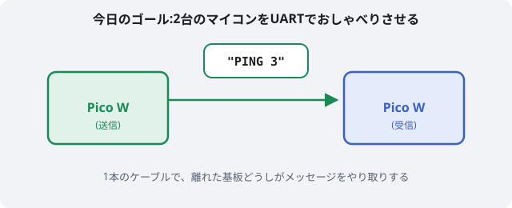
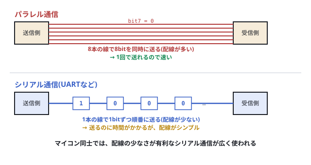
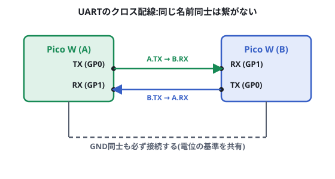
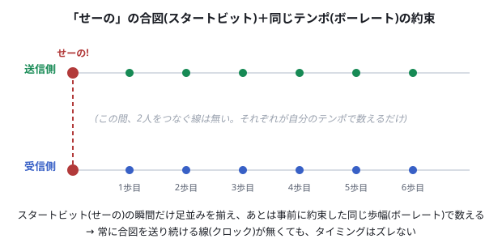
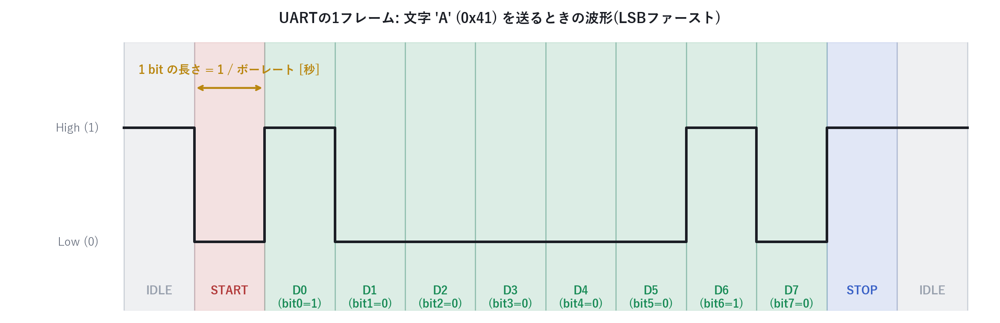

# 電子工作 第3回 UARTでマイコン同士を通信させる

前回まで(出力→タクトスイッチ入力)は、すべて**1台のマイコンの中**で完結していました。今日は初めて、**2台のRaspberry Pi Pico Wを線でつなぎ、マイコン同士がおしゃべりする**体験をします。CanSatでも、機体内の複数のマイコンや、地上局との通信はこの延長線上にあります。

今日は自分の手元にある2台のPico Wを、両方とも自分で操作します。片方が「話す(送信)」役、もう片方が「聞く(受信)」役です。



> **今回のマインドセット**
> - 最初は「送って、届く」というだけの最小構成から。難しい設定は後回し
> - ボーレートをわざとズラして、文字化けを一度体験しておくと、あとの理解が早くなります
> - 2台同時に操作するので、最初は少し混乱するかもしれません。ゆっくりで大丈夫です

## 1. なぜ「通信」が必要か

1台のマイコンの中では、GPIOの数だけしか情報を扱えません。複数のマイコンが手分けして仕事をするには、お互いに情報をやり取りする方法が必要です。これが**通信**です。

配線の本数という観点で、通信は大きく2つに分かれます。



| 方式 | 特徴 |
| --- | --- |
| パラレル通信 | 複数の線で一度にまとめて送る。速いが配線が多い |
| シリアル通信 | 1本の線で1bitずつ順番に送る。配線は少ないが、送るのに時間がかかる |

配線の少なさが有利なため、マイコン同士の通信では**シリアル通信**が広く使われます。今日学ぶ**UART**は、その代表的な方式の1つです。

## 2. 準備するもの

- Raspberry Pi Pico W ×2
- ジャンパワイヤ
- PCとマイコンをつなぐケーブル ×2

### 2台のPico Wをどう動かすか

UARTで通信させるには、**送信側・受信側の両方が同時に電源が入って動いている**必要があります。ここで、PCのUSBポートが2つ余っているとは限らないので、次の方法をおすすめします。

**方法:1台ずつ書き込み、片方は電源だけつないで自走させる**

1. ボードAをPCにつなぎ、送信プログラムを書く
2. Thonnyの **ファイル → 名前を付けて保存 → Raspberry Pi Pico** から、ファイル名を **`main.py`** として保存する(`main.py`という名前で保存すると、その後は**PCにつながなくても、電源を入れるだけで自動的にそのプログラムが実行される**ようになります)
3. ボードAをPCから外し、モバイルバッテリーやACアダプタなど、**別の電源**につなぎ直す(動き続けます)
4. 空いたPCのポートにボードBをつなぎ、受信プログラムを書いて実行する
5. ボードBのThonnyシェルを見ながら、ボードAから届くメッセージを観察する

*(ここにボードAをモバイルバッテリーにつなぎ、ボードBをPCにつないで観察している様子の写真を貼る。`06_dual_board_power_setup.jpg`)*

> 💡 **PCのUSBポートが2つ以上空いている場合**
> Thonnyの **ファイル → 新しいウィンドウ** を選び、2つ目のウィンドウで別のPico Wに接続すれば、2台を同時にPCへつないで、両方のシェルを見比べながら観察することもできます。ポート数に余裕があるときはこちらの方が手軽です。

以降、片方を**ボードA**、もう片方を**ボードB**と呼びます。マスキングテープなどにA/Bと書いて貼っておくと混乱しません。

## 3. まず動かしてみる:固定文字列を送受信

### 配線する

ボードAとボードBを、次のようにクロス接続します。



| ボードA | ↔ | ボードB |
| --- | --- | --- |
| GP0 (TX) | → | GP1 (RX) |
| GP1 (RX) | ← | GP0 (TX) |
| GND | — | GND |

**TXとRXは、同じ名前同士ではなく、互い違いに接続する**のがポイントです(理由は次の章で説明します)。GND同士の接続も忘れないでください。

### ボードA(送信側)のコード

```py
from machine import UART, Pin
import time

uart = UART(0, baudrate=9600, tx=Pin(0), rx=Pin(1))

count = 0
while True:
    msg = "PING {}\n".format(count)
    uart.write(msg)
    print("送信:", msg.strip())
    count += 1
    time.sleep(1)
```

### ボードB(受信側)のコード

```py
from machine import UART, Pin
import time

uart = UART(0, baudrate=9600, tx=Pin(0), rx=Pin(1))

while True:
    if uart.any():
        data = uart.readline()
        if data:
            print("受信:", data.decode("utf-8").strip())
    time.sleep(0.05)
```

前の手順の通り、ボードAには送信プログラムを`main.py`として保存して電源をつなぎ、ボードBはPCにつないで受信プログラムを実行してください。ボードBのシェルに「受信: PING 0」「受信: PING 1」…と1秒おきに表示されれば成功です。**電源だけをつないだ別の基板から、実際にデータが届いている**ことを確認してください。

*(ここにボードBのThonnyシェルに受信ログが流れている様子のスクリーンショットを貼る。`07_uart_send_receive_result.png`)*

## 4. なぜこの配線なのか:UARTのトポロジー

UARTは、**送信専用の線(TX)と受信専用の線(RX)**を1本ずつ使う通信方式です。

TX(Transmitter:送信)とRX(Receiver:受信)は名前の通り役割が固定されているため、**自分のTXは、相手のRXにつながないと意味がありません**。同じ名前同士(TX-TX、RX-RX)をつないでしまうと、送信専用の線同士がつながるだけで、誰も受け取れなくなってしまいます。

GNDを共有するのは、2枚の基板が「同じ0Vの基準」を持っていないと、送られてきた電圧が本当にHighなのかLowなのか、正しく判断できないためです。

### スタートビットとボーレートによる同期

ここでUARTには、実は**タイミングを合わせるための線が1本もありません**(TXとRXの2本だけです)。それなのに、送信側と受信側は1bitずつズレずに読み書きできています。なぜでしょうか。

これは、2人で手拍子を合わせるときに似ています。**「せーの」で1回だけ合図を出し、あとはお互いが「同じテンポで手を叩こう」と事前に約束しておけば、誰かがずっと拍子を取り続けなくても、しばらくの間は手拍子がズレません。**



UARTでは、この「せーの」にあたるのが**スタートビット**、「同じテンポ」にあたるのが**ボーレート**です。合図の線を常時つなぎっぱなしにしなくても、「合図(スタートビット)」と「事前の約束(ボーレート)」さえ守られていれば、タイミングは合う――これがUARTの仕組みです。この考え方を**非同期式通信**と呼びます。

## 5. わざと文字化けさせる:ボーレートの正体

先ほどのコードには`baudrate=9600`という指定がありました。これは、**1秒間に何bit送るか**を表す速度の値です。クロック線が無いUARTでは、送信側と受信側が**あらかじめ同じ速度で読み書きすると約束しておく**ことでしか、タイミングを合わせられません。

これを体験するため、**ボードB(受信側)だけ**、ボーレートを変えて実行してみましょう。

```py
uart = UART(0, baudrate=4800, tx=Pin(0), rx=Pin(1))  # ← 4800に変更
```

ボードAは9600bpsのまま送信を続けてください。ボードBのシェルに、意味の分からない記号や文字化けした文字列が表示されるはずです。

*(ここにボーレート不一致で文字化けした受信結果のスクリーンショットを貼る。`08_baudrate_mismatch_garbled.png`)*

これは、受信側が「1bitの長さ」を送信側と違う長さで解釈してしまい、区切る位置がズレてしまうために起こります。ボードBのボーレートを`9600`に戻し、文字化けが直ることを確認してください。

## 6. パケット構造:1文字はどう送られるか

文字化けの原因をもっと深く見てみましょう。UARTは、1文字(1byte)を送るとき、次のような**決まった形(フレーム)**で送っています。



- **IDLE(待機)**:何も送っていないときはHigh
- **スタートビット**:送信の開始を知らせる、必ずLowになる1bit
- **データビット**:実際に送りたいデータ。8bitの場合が多く、**下位ビット(LSB)から順番に**送られる
- **ストップビット**:1フレームの終わりを示す、必ずHighになる1bit

受信側は、**Highから急にLowに変わった瞬間(スタートビットの立ち下がり)**を見つけて「ここから1文字が始まる」と判断し、そこから**あらかじめ決めたボーレート通りの間隔**で1bitずつ読み取っていきます。クロック線が無くても、この「スタートビットの合図」と「共通のボーレート」の組み合わせだけで、タイミングを合わせられる仕組みになっています。

先ほどの文字化けは、この「共通のボーレート」の約束が破られたために、正しいタイミングで読み取れなくなった結果だった、というわけです。

## 7. 確認課題

### 必須

1. ボードAからボードBへ、好きな文字列を送るプログラムに変えてみましょう。
2. 役割を交代し、ボードBから送信、ボードAで受信するプログラムも作ってみましょう(配線はそのまま、コードだけ入れ替えれば実現できます)。
3. **数字を送ってみる:1byteの壁**。文字列ではなく、数字を1byteとしてそのまま送るプログラムに変えてみましょう。

    ```py
    # 送信側(ボードA)
    from machine import UART, Pin
    import time

    uart = UART(0, baudrate=9600, tx=Pin(0), rx=Pin(1))

    count = 0
    while True:
        uart.write(bytes([count]))   # countの値をそのまま1byteとして送る
        print("送信(1byte):", count)
        count += 1
        time.sleep(0.3)
    ```

    このプログラムを実行し、`count`が増え続けるのを見守ってください。**ある数字になった瞬間、プログラムがエラーで止まる**はずです。何という数字になったときに、どんなエラーメッセージが出ましたか? 今日学んだ「データビットは8bit」という話からヒントを得て、なぜその数字が限界になるのか考えてみましょう。

### 発展(時間があれば)

前回・前々回に配線したボタン・LED・モーターを、UARTと組み合わせてみましょう。

- ボードAでタクトスイッチの状態を読み取り、押されたらボードBへメッセージを送る
- ボードBは受信したら、自分につないだLEDを点灯させる、またはモーターを回す

*(ここに確認課題を実際に動かした結果の写真または動画のワンシーンを貼る。`09_challenge_result.jpg`)*

## 8. 次回への接続

今日はUARTだけを扱いましたが、マイコンとセンサをつなぐときには、**I2C**や**SPI**という別の通信方式もよく使われます。どちらもクロック線を使う**同期式通信**で、今日の「クロックが無い」UARTとは考え方が異なります。次回、実際にセンサをつないで体験します。

## 9. 宿題

> 1. UARTはクロック線を使いません。それなのに、送信側と受信側でタイミングがズレずに、1bitずつ正しく読み取れるのはなぜでしょうか。今日学んだ**スタートビットの役割**からヒントを得て、自分なりに考えてきてください。
> 2. とはいえ、送信側と受信側の**内部クロック(時間を刻む部品)は、完全に同じ速さとは限りません**。ごくわずかな速度差でも、1フレームの中で何度もビットを数えるうちに、少しずつ誤差が積み重なっていきます。もし受信側が「ビットの境界(電圧が切り替わる瞬間)ぴったり」を読み取ろうとしていたら、フレームの後半でどんな問題が起きるでしょうか。また、実際のUARTはそれでも安定して読み取れています。**電圧を読み取るタイミングを、境界ではなくどこにずらせば、誤差に強くなると思いますか。** 今日見たパケット構造の波形図を見返しながら、自分なりに考えてきてください。
>
> 次回、みんなで答え合わせをします。

## 10. 参考

- <https://www.raspberrypi.com/documentation/microcontrollers/raspberry-pi-pico.html>(Raspberry Pi Pico シリーズ公式ドキュメント)
- <https://micropython-docs-ja.readthedocs.io/ja/latest/library/index.html>(MicroPython日本語リファレンス)
