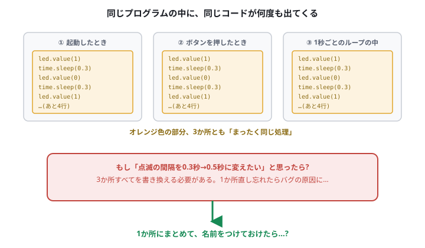
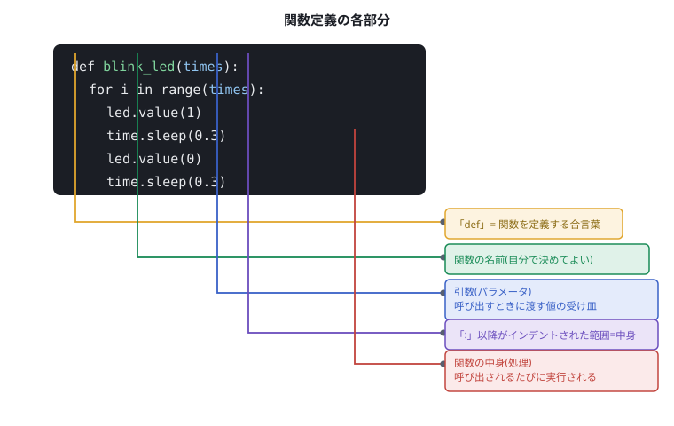
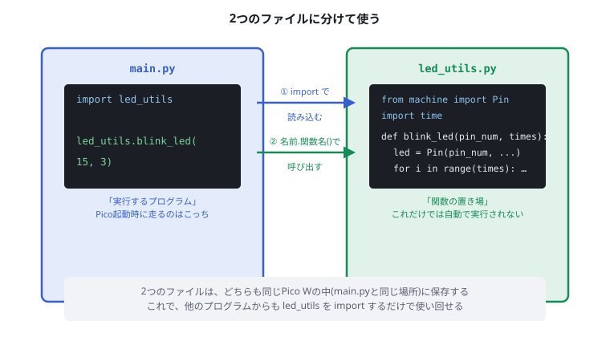
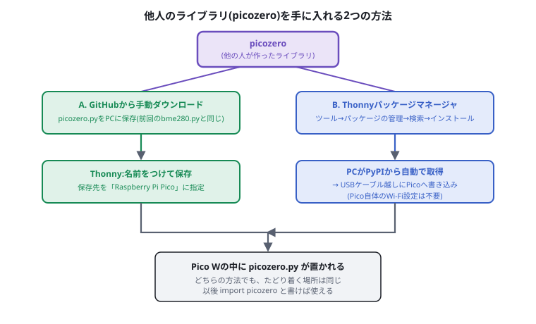

# 電子工作 第4回 関数定義とライブラリ

前回([05_UARTでマイコン同士を通信させる.md](./05_UARTでマイコン同士を通信させる.md))は、マイコン同士をUARTでおしゃべりさせました。今日は新しい部品もプロトコルも出てきません。今まで書いてきた**プログラムの書き方そのもの**を見直す回です。

来週([07_I2CとSPIでセンサと話す.md](./07_I2CとSPIでセンサと話す.md))から、`import bme280`のように**ライブラリ**を使うコードが登場します。「なぜimportするだけで動くのか」「あの中で何が起きているのか」を、今日体を動かして理解しておきましょう。


> **今回のマインドセット**
> - 今日使う部品は、第1回で使った**LED1個だけ**です。新しい配線はほぼありません
> - 「動くコードを書く」よりも、「同じコードを2度書かなくて済む書き方」を体験することが目的です
> - 難しく感じたら、まず手を動かして真似してみましょう。理屈は後からついてきます

## 1. 導入・問題提起:同じコードを何度も書くのはツライ

第1回([03_マイコン入門とLチカとモーター.md](./03_マイコン入門とLチカとモーター.md))で、LEDを点滅させるコードを書きました。もしこの「点滅」を、プログラムのいろいろな場面で使いたくなったらどうなるでしょうか。



- 起動したときに3回点滅
- ボタンが押されたときにも3回点滅
- 1秒ごとのループの中でも3回点滅

**まったく同じ処理を、コピー&ペーストで3か所に書く**ことになります。ここで「点滅の間隔を0.3秒から0.5秒に変えたい」と思ったら、3か所すべてを書き換えなければなりません。1か所直し忘れると、そこだけ動きが違う「バグ」になります。

> 💡 実際の開発現場でも、コピペで増えたコードの直し忘れは、非常によくあるバグの原因です。「同じ処理は1か所にまとめる」というのは、プログラミングの最も基本的な作法のひとつです。

この「1か所にまとめて、名前をつけて呼び出す」ための仕組みが、今日学ぶ**関数(function)**です。

## 2. 関数定義実践:繰り返しを1つにまとめる

まずは手を動かして、関数を作ってみましょう。配線は第1回と同じ、GP15にLEDをつないだままで大丈夫です。

### 関数を使わないコード(おさらい)

```py
from machine import Pin
import time

led = Pin(15, Pin.OUT)

led.value(1)
time.sleep(0.3)
led.value(0)
time.sleep(0.3)
led.value(1)
time.sleep(0.3)
led.value(0)
time.sleep(0.3)
led.value(1)
time.sleep(0.3)
led.value(0)
```

3回点滅させるだけで、同じ2行が6回も出てきます。これを関数にまとめてみましょう。

### 関数を使ったコード

```py
from machine import Pin
import time

led = Pin(15, Pin.OUT)

def blink_led(times):
    for i in range(times):
        led.value(1)
        time.sleep(0.3)
        led.value(0)
        time.sleep(0.3)

blink_led(3)
time.sleep(1)
blink_led(5)
```

実行してみましょう。`blink_led(3)`で3回、`blink_led(5)`で5回、LEDが点滅すれば成功です。**「点滅する」という処理そのものは1か所にしか書いていない**のに、何度でも・違う回数で呼び出せていることに注目してください。

*(撮影:`blink_led(3)`と`blink_led(5)`を実行し、LEDが点灯している瞬間の写真。Thonnyの画面とLEDが1枚に収まっていると、どのコードで光っているかが伝わります。`05_blink_result.png`)*

試しに、`time.sleep(0.3)`の`0.3`を`0.5`に変えて、もう一度実行してみましょう。**1か所直すだけで、すべての呼び出しに反映される**はずです。

## 3. 関数定義の解説

先ほど書いたコードを、部品ごとに分解してみましょう。



| 部分 | 役割 |
| --- | --- |
| `def` | 「ここから関数を定義します」という合言葉。Pythonの決まった書き方 |
| `blink_led` | 関数の名前。変数名と同じく、自分で好きな名前をつけられる |
| `(times)` | **引数(ひきすう)**。関数を呼び出すときに渡す値の受け皿。ここでは`times`という名前で受け取っている |
| `:` | これ以降、インデント(字下げ)された範囲が「関数の中身」になる |
| インデントされた部分 | 関数の中身(処理)。呼び出されるたびに、ここが実行される |

### 呼び出し(call)と引数

`blink_led(3)`と書くと、`3`が関数の中の`times`という名前に代入されて、関数の中身が実行されます。`blink_led(5)`なら`times`には`5`が入ります。**同じ関数なのに、渡す値によって違う回数動く**のはこのためです。

```py
blink_led(3)  # times に 3 が入る → 3回点滅
blink_led(5)  # times に 5 が入る → 5回点滅
```

### 値を返す関数(return)

今回の`blink_led`は「LEDを点滅させる」という**動作**をするだけで、値を返してはいません。関数の中には、計算した結果を`return`で呼び出し元に**返す**ものもあります。

```py
def add(a, b):
    return a + b

result = add(2, 3)
print(result)  # 5 と表示される
```

`return`が実行されると、その値が関数の呼び出し元にそのまま渡されます。「動作をする関数」と「値を計算して返す関数」の両方があることを覚えておいてください。

## 4. ライブラリ作成:関数を別ファイルに分ける

`blink_led`関数のおかげで、**1つのファイルの中では**何度でも使い回せるようになりました。では、来週作る別のプログラムでも同じ`blink_led`を使いたくなったらどうしますか?

- 案1:また同じ関数定義をコピペする → 結局、第1節と同じ「コピペ問題」に逆戻り
- 案2:関数だけを**別のファイル**に書いておき、必要なプログラムから読み込む(`import`する)

案2が、まさに前回までの`import bme280`のような書き方の正体です。関数をまとめた「専用のファイル」のことを**ライブラリ**または**モジュール**と呼びます。



## 5. ライブラリ作成実践:自分のライブラリを作ってみる

`blink_led`関数を、`led_utils.py`という別ファイルに引っ越しさせましょう。

### ① `led_utils.py` を作る

Thonnyで新しいファイルを作り、次のコードを書きます。**ファイルの中では、`Pin`の準備も関数の中で行う**ように少し書き換えます。関数の外に書いた変数は、その変数が書かれたファイルの中からしか見えません。そのため、`led_utils.py`が必要とするものは`led_utils.py`の中で用意します。

```py
# led_utils.py
from machine import Pin
import time

def blink_led(pin_num, times):
    led = Pin(pin_num, Pin.OUT)
    for i in range(times):
        led.value(1)
        time.sleep(0.3)
        led.value(0)
        time.sleep(0.3)
```

**ファイル→名前をつけて保存→Raspberry Pi Pico**を選び、ファイル名を`led_utils.py`としてPico W本体に保存してください。

> ⚠️ ファイル名は、すでにあるモジュールと重複しない名前にしてください。たとえば`time.py`や`machine.py`という名前で保存すると、本来読み込みたいモジュールとどちらが使われるのか分からなくなり、原因の特定しにくい不具合につながります。

### ② `main.py` から呼び出す

別のファイル(`main.py`)を新しく作り、次のように書きます。

```py
# main.py
import led_utils

led_utils.blink_led(15, 3)
```

こちらも同じく、Pico W本体に`main.py`として保存してください。実行すると、`led_utils.py`の中の`blink_led`関数が呼び出され、LEDが3回点滅するはずです。

> ⚠️ `import led_utils`が失敗する(`ImportError`が出る)場合、`led_utils.py`と`main.py`が**同じ場所(Pico W本体の直下)**に保存されているか確認してください。

*(撮影:Thonny左側のファイル一覧に、Pico W上の`led_utils.py`と`main.py`が並んで表示されている状態で`main.py`を実行した画面。赤枠は「2つのファイルが並んでいる部分」に。`06_led_utils_result.png`)*

**`関数名(引数)`ではなく`ファイル名.関数名(引数)`という書き方**になっている点に注目してください。「`led_utils`というファイル(ライブラリ)の中の`blink_led`という関数を呼ぶ」という意味です。来週使う`bme280.BME280(...)`という書き方も、まったく同じ形をしています。

### ③ もう1つの書き方:`from`で関数だけを取り出す

`import`には、もう1つよく使われる書き方があります。`main.py`を次のように書き換えて、実行してみましょう。

```py
# main.py(書き方2)
from led_utils import blink_led

blink_led(15, 3)
```

`from ファイル名 import 関数名`と書くと、**そのファイルの中の特定の関数だけ**を取り出して使えます。この場合、呼び出すときに`led_utils.`を付ける必要がありません。

| 書き方 | 呼び出し方 | 性質 |
| --- | --- | --- |
| `import led_utils` | `led_utils.blink_led(15, 3)` | どのファイル由来の関数かが呼び出し側で分かる |
| `from led_utils import blink_led` | `blink_led(15, 3)` | 短く書けるが、どのファイル由来かは呼び出し側からは分からない |

どちらで書いても動作は同じです。次の第6節では`from picozero import LED`という書き方が出てきますが、これは表の下の行と同じ形です。

> ⚠️ `led_utils.py`を書き換えたのに、`main.py`を実行しても変更が反映されないことがあります。一度読み込んだファイルの中身は記憶されているためです。シェル(下のウィンドウ)をクリックして`Ctrl+D`を押し、ソフトリブートしてから実行し直してください。第1回の「モーターを止めたあと、PCと繋がらなくなったら」と同じく、**マイコンが前の状態を持ち越している**ことが原因です。

## 6. 他者が作成したライブラリを使う

ここまでで、自分で作った関数を、自分でライブラリとして呼び出せるようになりました。しかし実際の開発では、**すでに世界中の誰かが作って公開してくれているライブラリ**を使う場面がとても多くあります。CanSatの開発でも、センサやモータードライバのライブラリなど、他人の書いたコードにお世話になることがほとんどです。

今日は例として、Raspberry Pi財団が公開している[`picozero`](https://github.com/RaspberryPiFoundation/picozero)というライブラリを使ってみます。LEDやボタンなどの部品を、より簡単に扱えるようにしてくれるライブラリです。

### 手に入れる方法は2通り



**方法A:GitHubから手動ダウンロード**(前回`bme280.py`を使ったのと同じ手順)

1. [picozeroのGitHubページ](https://github.com/RaspberryPiFoundation/picozero)から`picozero.py`をダウンロードする
2. Thonnyで開き、**ファイル→名前をつけて保存→Raspberry Pi Pico**で`picozero.py`として保存する

**方法B:Thonnyのパッケージマネージャを使う**(今日はじめて紹介する方法)

1. Thonnyのメニューから**ツール→パッケージの管理…**を開く
2. 検索欄に`picozero`と入力し、**PyPIで検索**をクリック
3. 検索結果から`picozero`を選び、**インストール**をクリック

*(撮影:ツール→パッケージの管理…を開き、検索欄に`picozero`と入力して「PyPIで検索」を押した直後の、検索結果が一覧表示されている画面。赤枠は「検索欄と検索結果」に。`07_thonny_manage_packages.png`)*

> 💡 方法Bは、PC側がインターネット(PyPIという「Pythonのライブラリ置き場」)から取得し、**USBケーブル経由でPico Wに書き込みます**。Pico W自体をWi-Fiに接続する設定は不要です。方法A・Bのどちらでも、最終的にPico Wの中に`picozero.py`が置かれる点は同じです。

参考までに、picozeroが実際に公開されているPyPI(Python Package Index、Thonnyの「PyPIで検索」が検索している場所そのもの)のページは<https://pypi.org/project/picozero/>です。授業の場でブラウザから開いて見せると、「検索結果の裏に実際のページがある」ことが実感しやすくなります。

*(撮影:検索結果から`picozero`を選び、インストールボタンが表示されている詳細画面。赤枠は「インストールボタン」に。ブラウザで<https://pypi.org/project/picozero/>を開いた画面でも構いません。`08_picozero_pypi.png`)*

### 使ってみる

`picozero`をインストールしたら、次のコードを書いてみましょう。

```py
from picozero import LED
import time

led = LED(15)
led.blink(on_time=0.3, off_time=0.3, n=3)
```

自分で書いた`blink_led`関数と、**同じことをしている**のが分かるでしょうか。違いは、`on_time`・`off_time`・`n`のように、picozeroの作者があらかじめ用意してくれた便利な引数が使えることです。

> 💡 Pico Wのオンボード(基板上)のLEDだけを使いたい場合は、`from picozero import pico_led`と書くと、配線なしでそのまま使えます。

*(撮影:picozeroのコードを実行し、LEDが点滅している様子。`05_blink_result.png`と同じく、コードとLEDが1枚に収まる構図が分かりやすいです。`09_picozero_result.png`)*

## 7. おさらい:3つの「関数の置き場所」

| | 同じファイルの中の関数 | 自作のライブラリ(別ファイル) | 他人のライブラリ(PyPI等) |
| --- | --- | --- | --- |
| 定義した場所 | `main.py`など、今書いているファイル自身 | `led_utils.py`など、自分で作った別ファイル | `picozero.py`など、他人が作ったファイル |
| 読み込み方 | 不要(同じファイルの中にある) | `import led_utils` | `from picozero import LED` |
| 呼び出し方 | `blink_led(3)` | `led_utils.blink_led(15, 3)` | `led.blink(...)` |
| 手に入れる方法 | 自分で`def`する | 自分で`def`して別ファイルに保存する | ダウンロード、またはパッケージマネージャでインストール |
| 今日出てきた例 | `blink_led`(第2節) | `led_utils.py`(第5節) | `picozero`(第6節) |

`import`という1つの命令の裏側には、**「誰が作った関数を、どこから持ってくるか」という違い**が隠れています。来週の`import bme280`も、方法Aと同じ「誰か(SpaceAcademy)が作ったライブラリを、ファイルごと持ってくる」パターンです。

## 8. 確認課題

### 必須

1. `led_utils.py`に、点滅の間隔(オン・オフの秒数)も引数で指定できる関数を追加してみましょう。例:`blink_led_v2(pin_num, times, interval)`。`main.py`から`blink_led_v2(15, 3, 0.1)`のように呼び出して、素早い点滅になることを確認してください。
2. `add(a, b)`のように、値を`return`する関数を自分でもう1つ作ってみましょう(LEDやセンサに関係のない、計算だけの関数で構いません)。例:2つの数の大きい方を返す関数、秒を分と秒に変換する関数、など。

### 発展(時間があれば)

- 第1回で扱った**モーター**、第2回で扱った**タクトスイッチ**の操作も、それぞれ関数にしてみましょう(例:`motor_on(seconds)`、`is_button_pressed(pin_num)`)。`led_utils.py`のような形で別ファイルにまとめても構いません。
- `picozero`には`Button`クラスも用意されています。[ドキュメント](https://picozero.readthedocs.io/)を調べながら、自分で作った`is_button_pressed`関数と、`picozero`の`Button`クラスの書き心地を比べてみましょう。

*(撮影:確認課題1の`blink_led_v2(15, 3, 0.1)`を実行した様子、または確認課題2で作った関数の戻り値がシェルに表示されている画面。赤枠は「シェルの出力」に。`10_challenge_result.png`)*

## 9. 宿題

> 予習として、[picozeroのGitHubページ](https://github.com/RaspberryPiFoundation/picozero)または[ドキュメント](https://picozero.readthedocs.io/)を開いてみてください。`LED`クラス以外に、どんな部品を扱うクラス(例:`Button`、`Motor`、`Buzzer`など)が用意されているか、3つ探してみましょう。それぞれ「CanSatのどんな場面で使えそうか」を、自分の言葉で一言メモしてきてください。次回、みんなで紹介し合います。

## 10. 参考

- <https://picozero.readthedocs.io/>(picozero 公式ドキュメント)
- <https://github.com/RaspberryPiFoundation/picozero>(picozero GitHubリポジトリ)
- <https://pypi.org/project/picozero/>(picozero PyPIページ)
- <https://micropython-docs-ja.readthedocs.io/ja/latest/library/index.html>(MicroPython日本語リファレンス)
