# 通信 第1回 WiFiでTCPとUDPを体験する

ここから新しいシリーズ、**通信講座**が始まります。電子工作講座では、マイコンと部品(LED・センサなど)が会話する方法を学びました。今日からは、**マイコンとPC、あるいはPC同士が、ネットワークを介して会話する方法**を学びます。

CanSatの本番でも、機体の位置情報を地上に送る(ダウンリンクする)ときは、必ず何らかの形でこの「通信」の考え方が使われます。今日はその入り口として、みなさんが毎日使っているWi-Fiを使い、**UDP**と**TCP**という2つの話し方を体験します。

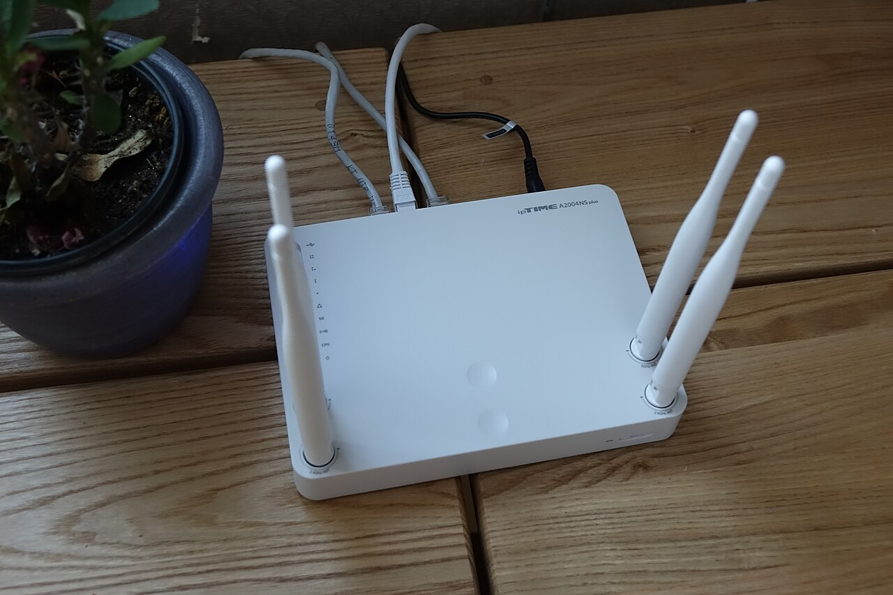

> 出典:[Wikimedia Commons](https://commons.wikimedia.org/wiki/File:20150208ipTIME_A2004NS_Wireless_router.jpg)(CC BY-SA 4.0, 최광모)。普段あまり意識しない、このアンテナが生えた小さな箱が、今日の主役です。

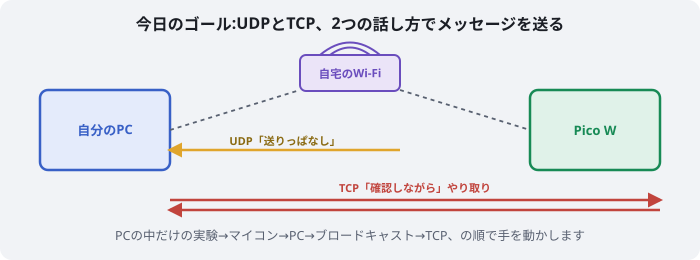

> **今回のマインドセット**
> - 電子工作講座と同じく、**理屈を厳密に理解するより先に、まず手を動かして「動いた」を体験する**ことを優先します
> - 難しい言葉(プロトコル、ソケット、etc.)が出てきますが、全部を覚える必要はありません。「へー、そういう仕組みなんだ」くらいの感覚でOKです
> - 今日は配線もはんだ付けもありません。使うのはPCとPico Wの中身(ソフトウェア)だけです

## 1. 事前準備:自宅のWi-Fi情報を確認する

今日は各自、自宅のWi-Fiを使って進めます。Pico WをこのWi-Fiに接続させるため、まず次の3つを手元に控えておきましょう。

- ① 自宅Wi-FiのSSID(ネットワーク名)
- ② 自宅Wi-Fiのパスワード
- ③ 自分のPCのIPアドレス(Wi-Fi接続時のもの)

### ①②:SSIDとパスワードを調べる(Windows)

1. タスクバーのWi-Fiアイコンをクリックすると、接続中のネットワーク名(SSID)が表示されます
2. パスワードは、**コマンドプロンプトを管理者として開き**、次のコマンドを実行すると確認できます

```bat
netsh wlan show profile name="ここに①のSSID" key=clear
```

「セキュリティ設定」という項目の中の**「キーコンテンツ」**に表示される文字列がパスワードです。

> 💡 これは「すでにそのWi-Fiに接続したことがあるPC」だからこそ見られる情報です。他人の家のWi-Fiのパスワードを調べる方法ではないので、悪用しないようにしてください。

Macの場合は、システム設定の「Wi-Fi」→ネットワーク名の詳細から確認するか、「キーチェーンアクセス」アプリでネットワーク名を検索すると、パスワードを表示できます(初回はMacのログインパスワード入力を求められます)。

### ③:自分のPCのIPアドレスを調べる(Windows)

コマンドプロンプトで次を実行します。

```bat
ipconfig
```

「**Wi-Fi**」というアダプターの項目の中にある、**「IPv4 アドレス」**の値(`192.168.○.○`のような形)をメモしておきます。これは4節で使います。

## 2. UDPで通信を試す:まずはPCの中だけで

### 2.1 ホストとクライアントを作る

UDPは、Pythonの標準ライブラリ`socket`を使うと数行で書けます。まずは**同じPCの中だけ**で完結する、一番シンプルな形から試しましょう。次の2つのファイルを作ってください(いつも使っているThonnyでそのまま書けます。右下のインタプリタを「ローカルのPython 3」に切り替えて使います)。

```py
# udp_receiver.py (受信側)
import socket

HOST = "127.0.0.1"  # 自分自身(このPC)を表すアドレス
PORT = 9001

sock = socket.socket(socket.AF_INET, socket.SOCK_DGRAM)  # UDPソケットを作る
sock.bind((HOST, PORT))  # このアドレス・ポートで「待ち受け」を開始

print(f"{PORT}番ポートで待ち受け中...")

while True:
    data, addr = sock.recvfrom(1024)  # 届くまでここで待つ
    print(f"{addr} から受信: {data.decode('utf-8')}")
```

```py
# udp_sender.py (送信側)
import socket
import time

HOST = "127.0.0.1"
PORT = 9001

sock = socket.socket(socket.AF_INET, socket.SOCK_DGRAM)

count = 0
while True:
    message = f"メッセージ {count}"
    sock.sendto(message.encode("utf-8"), (HOST, PORT))  # 送るときは宛先を毎回指定する
    print("送信:", message)
    count += 1
    time.sleep(1)
```

### 2.2 動かしてみる

Thonnyの**ウィンドウを2つ**(ファイル→新しいウィンドウ)開き、片方で`udp_receiver.py`を実行(▶)、もう片方で`udp_sender.py`を実行します。**先に受信側を起動してから**送信側を起動してください。

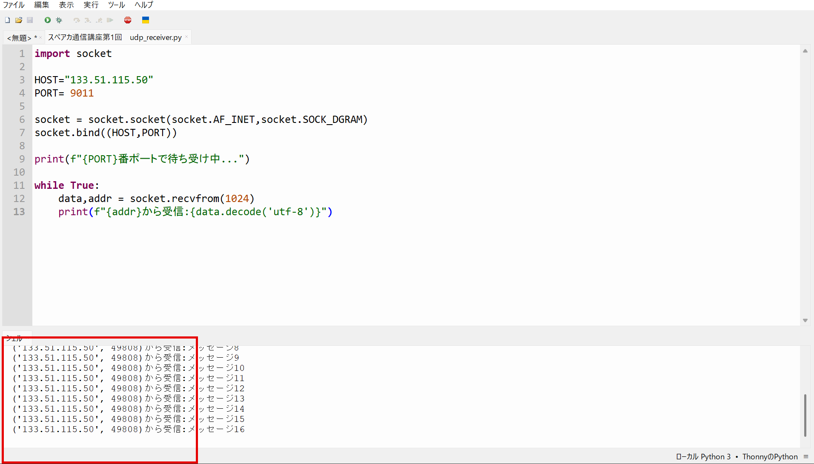

受信側のシェルに「`('127.0.0.1', ○○○○) から受信: メッセージ 0`」のように表示されれば成功です。1秒ごとに数字が増えていくのを確認しましょう。

コードの中身を完全に理解できなくても構いません。**まずは「動いた」**という感覚を掴んでください。

## 3. マイコンからPCへUDPを送ってみる

同じことを、今度は**Pico WからPC**に向けてやってみます。ここで、PC内だけでは意識しなかった問題にぶつかります。

### 3.1 わざと失敗させてみる

Pico WをWi-Fiに接続し、UDPで送信するコードを書きます。**まだ2節のIPアドレス調べは使わず**、宛先IPアドレスに適当な値を入れてみましょう。

```py
# pico_udp_sender.py (Pico W側)
import network
import socket
import time

SSID = "ここに①のSSID"
PASSWORD = "ここに②のパスワード"

wlan = network.WLAN(network.STA_IF)
wlan.active(True)
wlan.connect(SSID, PASSWORD)

print("Wi-Fiに接続中...")
while not wlan.isconnected():
    time.sleep(0.5)

print("接続成功! Pico WのIPアドレス:", wlan.ifconfig()[0])

PC_IP = "192.168.1.99"  # ← まだ調べていない、適当な値
PORT = 9002

sock = socket.socket(socket.AF_INET, socket.SOCK_DGRAM)

count = 0
while True:
    message = f"Pico Wから {count}"
    sock.sendto(message.encode("utf-8"), (PC_IP, PORT))
    print("送信:", message)
    count += 1
    time.sleep(1)
```

PC側では、2.1の`udp_receiver.py`を、`HOST`だけ`"0.0.0.0"`に変えて(理由は次項で説明します)、ポートを9002に変えたものを用意し、実行しておきます。

```py
# udp_receiver2.py (受信側、PC)
import socket

HOST = "0.0.0.0"  # 自分のすべてのネットワーク(Wi-Fi含む)からの通信を受け取る
PORT = 9002

sock = socket.socket(socket.AF_INET, socket.SOCK_DGRAM)
sock.bind((HOST, PORT))

print(f"{PORT}番ポートで待ち受け中...")

while True:
    data, addr = sock.recvfrom(1024)
    print(f"{addr} から受信: {data.decode('utf-8')}")
```

Pico W側を実行してみましょう。Thonnyのシェルには「送信: Pico Wから 0」のように**送信ログは表示され続けます**が、PC側の受信シェルには**何も表示されません**。

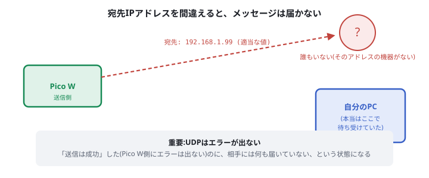

### 3.2 種明かし:IPアドレスの一致が必要

2.1の実験では`127.0.0.1`(自分自身)を使っていたので気づきませんでしたが、**UDPで送るときは、宛先の「住所(IPアドレス)」を正確に指定しないと届きません**。ポート番号だけ合っていても、住所が違う家に届くことはない、というのは考えてみれば当たり前ですね。

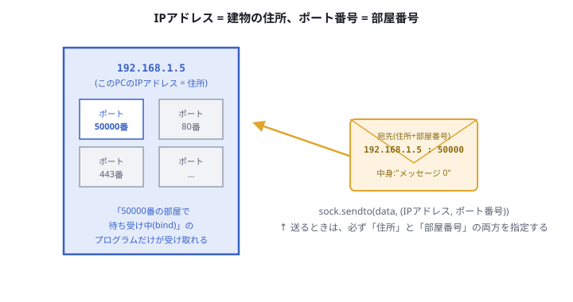

さらに重要な点として、**UDPはこの「届かない」状況でもエラーを出しません**。送信側からすれば「送信は成功した」ように見えるのに、実際には誰にも届いていない、ということが起こり得ます。これがUDPの大きな特徴のひとつです(6節でTCPとの違いとして詳しく比較します)。

> 💡 なぜ受信側は`HOST`を`"0.0.0.0"`にしたのか:`"127.0.0.1"`は「自分自身から自分自身へ」の通信しか受け取れません。Pico Wという**別の機器**からの通信を受け取るには、Wi-Fiなど**すべてのネットワーク経路を待ち受ける**という意味の`"0.0.0.0"`を指定する必要があります。

### 3.3 正しいIPアドレスで再挑戦

1節で調べておいた、**自分のPCの本当のIPアドレス**を`PC_IP`に書き直して、Pico W側をもう一度実行してみましょう。

```py
PC_IP = "192.168.○.○"  # 1節でipconfigして調べた、自分のPCの本当のIPアドレス
```

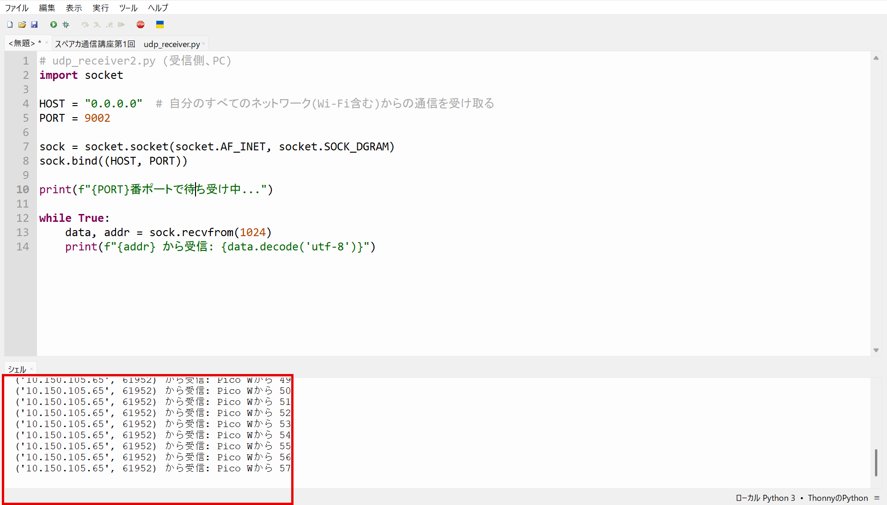

今度はPC側の受信シェルにもメッセージが表示されるはずです。**IPアドレスという「宛先の正確な指定」があって初めて、パケットは正しい相手に届く**ことを体感できました。

## 4. 相手のIPが分からないとき:ブロードキャスト

3節では「PCのIPアドレスをあらかじめ調べて、Pico W側にハードコーディングする」という方法を取りました。しかし、実際のCanSat開発ではこれが難しい場面があります。

> 例:スマートフォンのテザリングでPico Wをインターネットに繋ぐ場合、Pico Wに割り振られるIPアドレスは**接続するたびに変わる**ことがあります。相手(PC)側も、Pico Wの現在のIPアドレスを知る手段がありません。

この「相手のIPアドレスが分からない」問題を解決するのが、**ブロードキャスト**です。「特定の1台」ではなく「同じネットワークにいる全員」に向けてパケットを送ります。

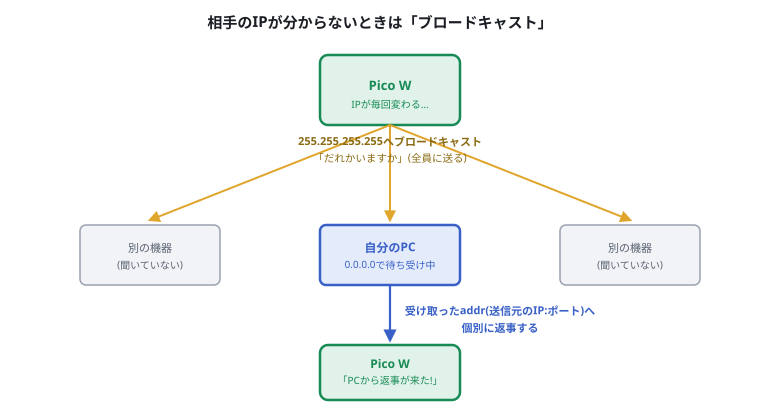

### 4.1 実装する

**送信側(Pico W)**:ネットワーク全体を表す`255.255.255.255`宛てに送ります。

```py
# pico_broadcast_sender.py (Pico W側)
import network
import socket
import time

SSID = "ここに①のSSID"
PASSWORD = "ここに②のパスワード"

wlan = network.WLAN(network.STA_IF)
wlan.active(True)
wlan.connect(SSID, PASSWORD)
while not wlan.isconnected():
    time.sleep(0.5)
print("接続成功:", wlan.ifconfig()[0])

PORT = 9003

sock = socket.socket(socket.AF_INET, socket.SOCK_DGRAM)
try:
    sock.setsockopt(socket.SOL_SOCKET, socket.SO_BROADCAST, 1)
except (AttributeError, OSError):
    pass  # 一部のMicroPythonファームウェアではこの設定自体が無くても送信できます

while True:
    message = "だれかいますか?"
    sock.sendto(message.encode("utf-8"), ("255.255.255.255", PORT))
    print("ブロードキャスト送信:", message)

    sock.settimeout(3)
    try:
        data, addr = sock.recvfrom(1024)
        print(f"{addr} から返事: {data.decode('utf-8')}")
    except OSError:
        print("(3秒待ったが返事なし)")

    time.sleep(2)
```

**受信側(PC)**:`0.0.0.0`で待ち受け、届いたパケットの送信元(`addr`)に対して**個別に**返事をします。

```py
# udp_broad_listener.py (PC側)
import socket

PORT = 9003

sock = socket.socket(socket.AF_INET, socket.SOCK_DGRAM)
sock.bind(("0.0.0.0", PORT))

print(f"{PORT}番ポートでブロードキャストを待ち受け中...")

while True:
    data, addr = sock.recvfrom(1024)
    print(f"{addr} から受信: {data.decode('utf-8')}")
    reply = "はい、聞こえています!"
    sock.sendto(reply.encode("utf-8"), addr)  # 受け取ったaddrにそのまま返す
    print("返信しました:", addr)
```

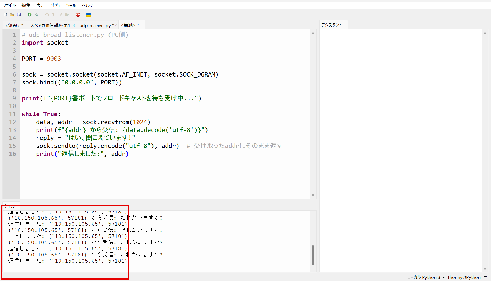

> ⚠️ MicroPythonのファームウェアによっては`SO_BROADCAST`という設定自体が存在しないことがあります。上のコードではそれを見越して`try/except`で囲んでいますが、それでもうまく届かない場合は、Thonnyの「ファームウェアの更新」から最新のMicroPythonに更新してみてください(付録の環境構築ページを参照)。

Pico WはPCの**IPアドレスを一度も指定していない**のに、返事(=PCの本当のIPアドレスを含んだパケット)を受け取れています。「まず全員に呼びかけて、返事してきた相手とだけ以後やり取りする」という、CanSatの通信でもよく使われる考え方です。

## 5. 通信ミスの可能性とTCP

### 5.1 問いかけ:届いたかどうか、どうやって確認する?

ここまでのUDP通信では、**送った側は「届いたかどうか」を知る手段がありません**でした。実際の無線通信では、電波が弱かったりノイズが乗ったりして、メッセージが届かない・化けることが普通に起こります。

**もしあなたがこの「届いたかどうか分からない」問題を解決するとしたら、どうしますか?** 少し考えてみてください。

> 💡 ヒント:電話で「もしもし、聞こえますか?」から会話を始めるのはなぜでしょうか。

### 5.2 ハンドシェイク

多くの人が思いつく解決策は、**「届いたら、届いたよと返事をする」**というものです。これを、通信を始める前の「挨拶」の形で毎回きちんと行う仕組みが**ハンドシェイク(握手)**です。

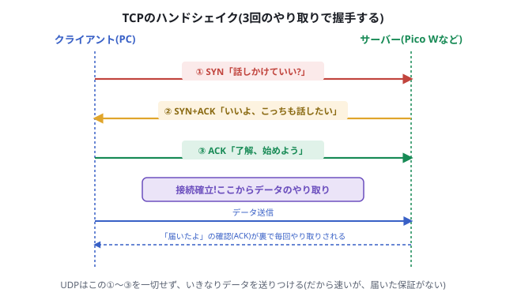

1. ① 送信側:「これから話しかけていいですか?(SYN)」
2. ② 受信側:「いいですよ、こちらも話したいです(SYN+ACK)」
3. ③ 送信側:「では始めます(ACK)」

この3回のやり取りで「お互いに準備ができた」ことを確認してから、本番のデータをやり取りします。データを送るたびにも「届いたよ(ACK)」の返事が裏側で行われ、返事が来なければ**自動的に送り直す**仕組みになっています。

この仕組みを持つプロトコルが**TCP**です。

## 6. TCPとUDPの違い

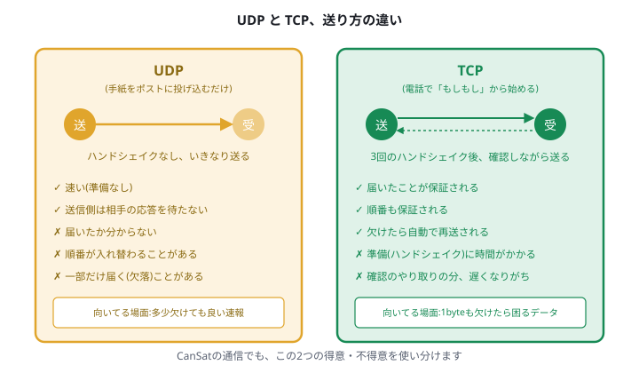

| | UDP | TCP |
| --- | --- | --- |
| 例え | 手紙をポストに投げ込む | 電話で「もしもし」から話す |
| ハンドシェイク | なし | あり(3回) |
| 届いた保証 | なし | あり(自動で再送される) |
| 順番の保証 | なし | あり |
| 速度 | 速い | ハンドシェイク・確認応答の分、遅くなりがち |
| コード上の違い | `sendto`で宛先を毎回指定 | `connect`で先に接続してから`send`/`recv` |

### TCPも実際に動かしてみる

```py
# tcp_server.py (受信側、先に起動しておく)
import socket

HOST = "0.0.0.0"
PORT = 9004

server = socket.socket(socket.AF_INET, socket.SOCK_STREAM)
server.bind((HOST, PORT))
server.listen(1)
print("接続を待っています...")

conn, addr = server.accept()  # ハンドシェイクが完了するまでここで待つ
print("接続確立:", addr)

while True:
    data = conn.recv(1024)
    if not data:
        break
    print("受信:", data.decode("utf-8"))
```

```py
# tcp_client.py (送信側)
import socket
import time

HOST = "127.0.0.1"  # まずはPC内で。Pico Wから送る場合はPCのIPアドレスに変える
PORT = 9004

sock = socket.socket(socket.AF_INET, socket.SOCK_STREAM)
sock.connect((HOST, PORT))  # ここで裏側にハンドシェイクが行われる

count = 0
while True:
    message = f"TCPメッセージ {count}"
    sock.sendall(message.encode("utf-8"))
    print("送信:", message)
    count += 1
    time.sleep(1)
```

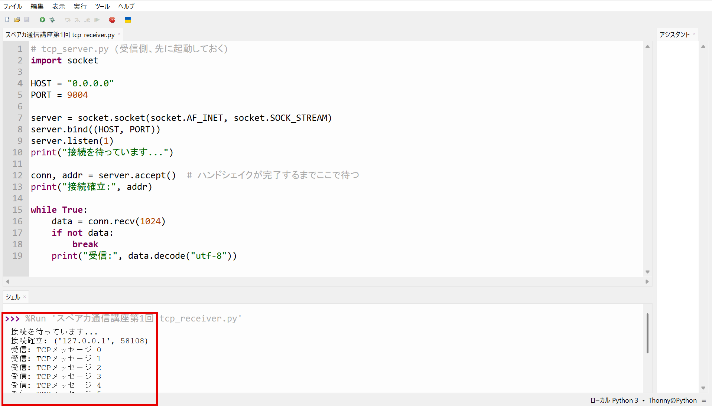

UDPのコードと見比べると、**送るたびに宛先を書く(`sendto`)のではなく、先に`connect`して「相手と繋がった状態」を作ってから送る(`sendall`)**という違いに気づくはずです。この違いこそが、ハンドシェイクの有無を表しています。

## 7. 大きいファイルを送って速度を比較する

最後に、UDPとTCPで実際に**大きめのファイル(画像など)**を送り、時間を計測して比べてみましょう。手元にある適当な画像ファイルを`sample.jpg`という名前で、スクリプトと同じフォルダに置いてください。

```py
# tcp_file_sender.py
import socket
import time

HOST = "127.0.0.1"
PORT = 9005

with open("sample.jpg", "rb") as f:
    data = f.read()

sock = socket.socket(socket.AF_INET, socket.SOCK_STREAM)
sock.connect((HOST, PORT))

start = time.time()
sock.sendall(data)
sock.close()
elapsed = time.time() - start

print(f"TCP送信完了: {len(data)} byte, {elapsed:.3f} 秒")
```

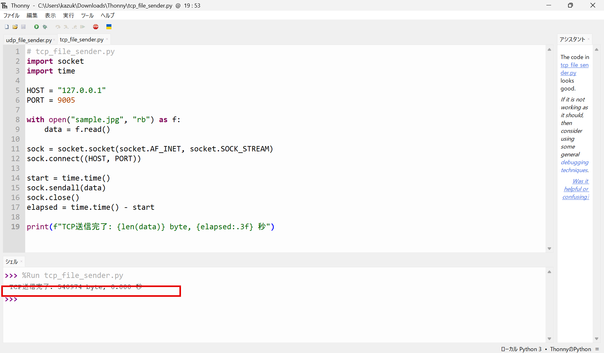

```py
# tcp_file_receiver.py
import socket

HOST = "0.0.0.0"
PORT = 9005

server = socket.socket(socket.AF_INET, socket.SOCK_STREAM)
server.bind((HOST, PORT))
server.listen(1)
print("待ち受け中...")

conn, addr = server.accept()
received = b""
while True:
    chunk = conn.recv(4096)
    if not chunk:
        break
    received += chunk

with open("received_tcp.jpg", "wb") as f:
    f.write(received)

print(f"TCP受信完了: {len(received)} byte")
```

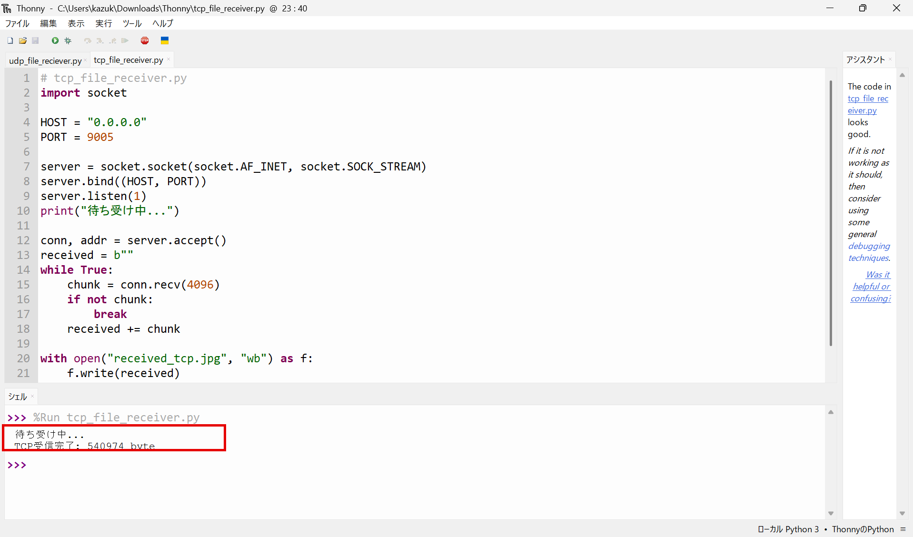

```py
# udp_file_sender.py
import socket
import time

HOST = "127.0.0.1"
PORT = 9006
CHUNK_SIZE = 1024  # UDPは大きすぎるデータを1回で送れないため、小分けにする

with open("sample.jpg", "rb") as f:
    data = f.read()

sock = socket.socket(socket.AF_INET, socket.SOCK_DGRAM)

start = time.time()
for i in range(0, len(data), CHUNK_SIZE):
    chunk = data[i:i + CHUNK_SIZE]
    sock.sendto(chunk, (HOST, PORT))
sock.sendto(b"END", (HOST, PORT))  # 「ここで終わり」の合図
elapsed = time.time() - start

print(f"UDP送信完了(送り終わるまで): {len(data)} byte, {elapsed:.3f} 秒")
```

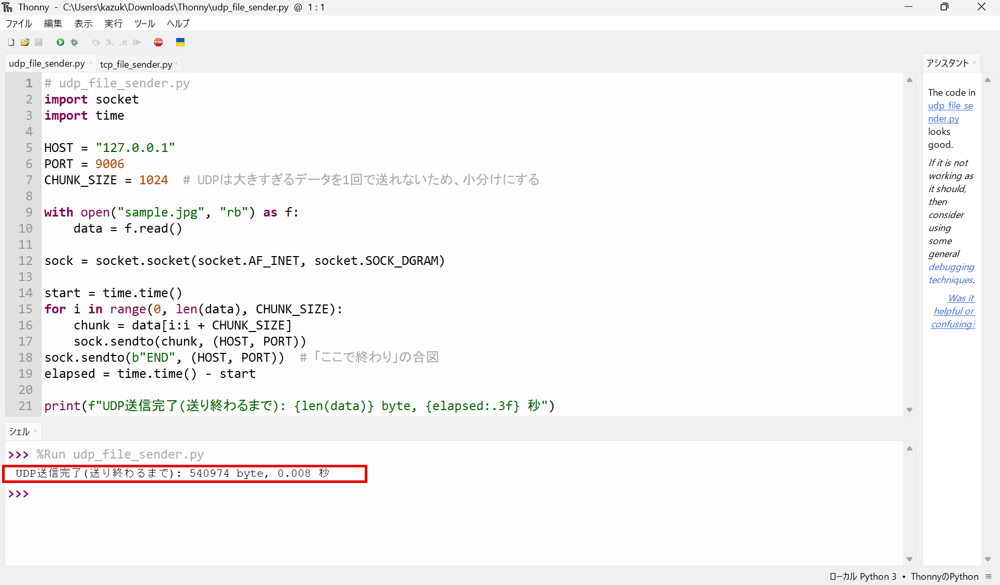

```py
# udp_file_receiver.py
import socket

HOST = "0.0.0.0"
PORT = 9006

sock = socket.socket(socket.AF_INET, socket.SOCK_DGRAM)
sock.bind((HOST, PORT))
print("待ち受け中...")

received = b""
while True:
    chunk, addr = sock.recvfrom(2048)
    if chunk == b"END":
        break
    received += chunk

with open("received_udp.jpg", "wb") as f:
    f.write(received)

print(f"UDP受信完了: {len(received)} byte(元のファイルサイズと比べてみよう)")
```

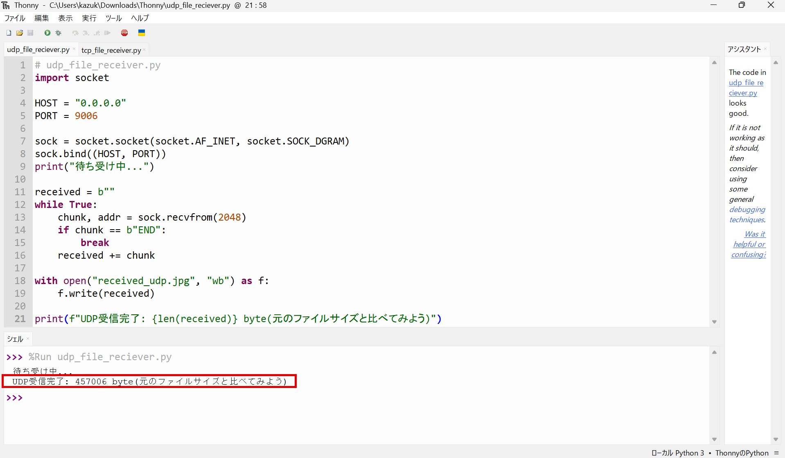

それぞれ実行し、表示された**時間(秒)**と、**受信できたbyte数**(`received_udp.jpg`のファイルサイズが元の`sample.jpg`と一致しているか)を記録して、比較表を作ってみましょう。

| | 送信バイト数 | 受信バイト数 | 所要時間 |
| --- | --- | --- | --- |
| TCP | 540974 | 540974 | 0.000 秒 |
| UDP | 540974 | 457006 | 0.008 秒 |

> 💡 同じPCの中(ループバック)で試す限り、UDPでもバイトの欠落はほとんど起きないはずです。欠落や順序の入れ替わりが目に見えて起きるのは、本物の無線(Wi-FiやLoRa)のように、ノイズや電波の弱さがある環境です。次回のLoRa回で、この違いをより実感できるはずです。
>
> ⚠️ 上の実行結果例では、同じPC内であってもUDPの受信バイト数が送信バイト数より少なくなっています(540974 byte → 457006 byte)。これはまさに「UDPは届いた保証がない」ことの実例です。CHUNK_SIZEを小さくする、送信間隔を空けるなどで改善することがありますが、根本的な解決にはなりません。この不安定さこそが、次章のTCP(またはUDP+独自の再送処理)が必要になる理由です。

## 8. 確認課題

### 必須

1. 2節のUDP送受信で、送信間隔(`time.sleep(1)`)を変えて実行し、受信側にどう表示されるか確認しましょう。
2. 4節のブロードキャストで、PC側の`reply`メッセージの中身を変えて、Pico W側にちゃんと変更後のメッセージが届くか確認しましょう。

### 発展(時間があれば)

- 6節のTCPサーバーを、複数のクライアントから同時に接続させるとどうなるか試してみましょう(`server.listen(1)`の`1`という数字がヒントです)。
- 3節のUDP送信を、Pico Wを2台用意して**同時に同じPCへ送信**させ、受信側でどちらから来たか(`addr`)を区別できることを確認してみましょう。


## 9. 宿題

> CanSatのダウンリンクでは、緯度・経度・高度・電池残量など複数の情報を一度に送ることがよくあります。もしあなたがCanSatの通信システムを設計するなら、この「複数の情報をまとめて送る」場面で、**UDPとTCPのどちらを選びますか?** 今日学んだ両者の特徴(速度・信頼性・ハンドシェイクの有無)を踏まえて、理由とともに考えてきてください。次回、みんなで答え合わせをします。

## 10. 参考

- <https://docs.python.org/ja/3/library/socket.html>(Python公式 socketモジュールドキュメント)
- <https://www.iana.org/assignments/service-names-port-numbers/service-names-port-numbers.xhtml>(ポート番号の割り当て一覧、IANA公式)
- <https://micropython-docs-ja.readthedocs.io/ja/latest/library/index.html>(MicroPython日本語リファレンス)