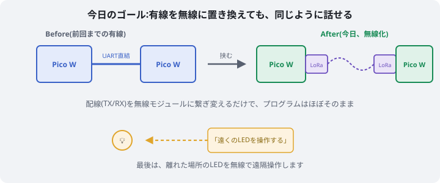
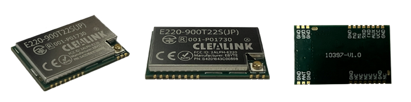
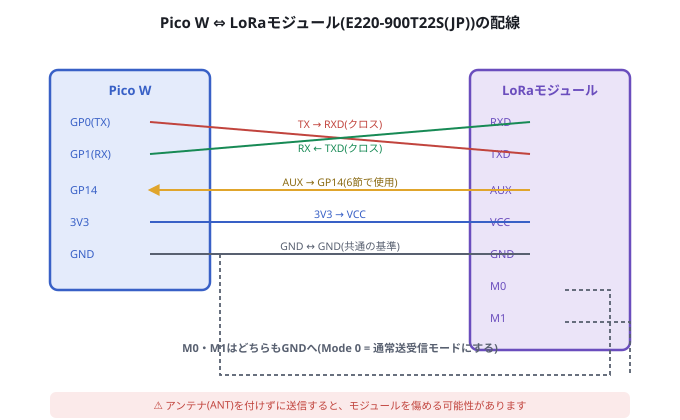
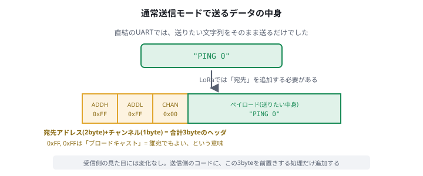
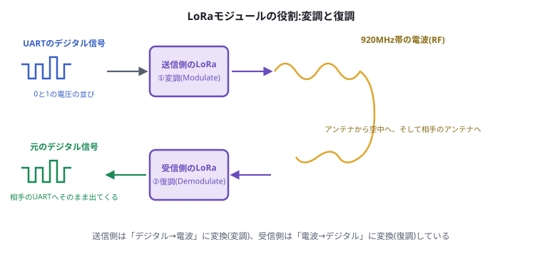
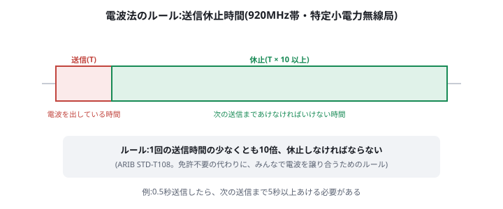

# 通信 第2回 LoRa無線モジュールを使ってみる

前回([08_WiFiでTCPとUDPを体験する.md](./08_WiFiでTCPとUDPを体験する.md))は、身近なWi-Fiを使って通信の基本を学びました。今日はいよいよ、**CanSat本番でも実際に使う無線モジュール**を使って、電波でのやり取りを体験します。



> **今回のマインドセット**
> - 難しい理論(電波の変調方式やスペクトラム拡散など)を完全に理解する必要はありません。「有線を無線に置き換えても、同じように話せる」という体験を大事にしてください
> - 今日使う無線機は、免許なしで使える**特定小電力無線局**です。届出や免許は不要ですが、守らなければならないルール(5節)があります。これは「知らなかった」では済まされない、実機を扱う上での大切な知識です

## 1. 今日使うもの



> 出典:[DRAGON TORCH(株式会社クレアリンクテクノロジー)公式サイト](https://dragon-torch.tech/rf-modules/lora/e220-900t22s-jp-r2/)

- Raspberry Pi Pico W × 2
- LoRaモジュール評価ボード **E220-900T22S(JP)-EV2** × 2([秋月電子通商](https://akizukidenshi.com/catalog/g/g131361/)、販売コード131361)
- LoRa用アンテナ × 2(例:TX915-JKS-20、秋月電子通商 販売コード117618)
- ジャンパワイヤ・ブレッドボード

このモジュールは、**920MHz帯**を使うLoRa通信モジュールです。見通しの良い場所では**最大約5km**届く一方、電波出力は**最大13dBm(20mW)**に抑えられた、免許不要の「特定小電力無線局」として設計されています。CanSatの実機でも、機体の位置情報を地上に送る(ダウンリンクする)ときに、これと同じ系統のモジュールがよく使われます。

## 2. まずは有線で:前回までのUART通信を思い出す

無線の前に、土台を思い出しましょう。第3回([05_UARTでマイコン同士を通信させる.md](./05_UARTでマイコン同士を通信させる.md))で、2台のPico WをUARTで直結し、一定間隔でメッセージを送り合いました。



> 💡 上の図はこの後のLoRa配線の説明用です。ここではまず、**LoRaモジュールを使わず**、2台のPico WのGP0(TX)とGP1(RX)を直接クロス接続してください(GNDも接続)。配線方法を忘れた場合は05を見返してください。

同じコードをもう一度動かしてみましょう。

```py
# board_a_sender.py(送信側)
from machine import UART, Pin
import time

uart = UART(0, baudrate=9600, tx=Pin(0), rx=Pin(1))

count = 0
while True:
    msg = "PING {}\n".format(count)
    uart.write(msg)
    print("送信:", msg.strip())
    count += 1
    time.sleep(1)
```

```py
# board_b_receiver.py(受信側)
from machine import UART, Pin

uart = UART(0, baudrate=9600, tx=Pin(0), rx=Pin(1))

while True:
    if uart.any():
        data = uart.readline()
        if data:
            try:
                print("受信:", data.decode("utf-8").strip())
            except UnicodeError:
                print("受信(文字化け):", data)
```

いつも通り、ボードAに送信プログラムを`main.py`として保存して電源をつなぎ、ボードBはPCにつないで受信プログラムを実行します。「受信: PING 0」「受信: PING 1」…と1秒おきに表示されることを確認してください。**これが今日の「基準(比較対象)」になります。**

## 3. LoRaモジュールを挟んでみる

### 3.1 配線する

先ほどの直結配線を外し、代わりに**それぞれのPico WとLoRaモジュールの間**を配線します。


| Pico W | LoRaモジュール |
| --- | --- |
| GP0(TX) | RXD |
| GP1(RX) | TXD |
| 3V3 | VCC |
| GND | GND |
| GND | M0 |
| GND | M1 |

> ⚠️ **M0とM1は、どちらも必ずGNDに接続してください。** 何も接続しないままだと、モジュールは初期状態(Config/DeepSleepモード)のままで、データの送受信が一切できません。M0=M1=Low(GND)にすることで、初めて「通常送受信モード(Mode 0)」になります。
>
> ⚠️ **アンテナを接続してから電源を入れてください。** アンテナなしで送信すると、内部の増幅回路を傷める可能性があります。

これで、**ボードAのPico W → ボードAのLoRaモジュール → (電波) → ボードBのLoRaモジュール → ボードBのPico W**、という経路ができました。

### 3.2 コードの変更点:宛先を追加する

先ほどのコードを、ほぼそのまま使います。ただし1つだけ、無線ならではの追加が必要です。直結のUARTには「宛先」という概念がありませんでしたが(TXの線がそのままRXの線につながっているので、送った相手は1つに決まっています)、LoRaモジュールは**「どのアドレス・どのチャンネル宛てか」を、送るデータの先頭3byteで指定する**必要があります。



```py
# board_a_sender.py(LoRa版・送信側)
from machine import UART, Pin
import time

uart = UART(0, baudrate=9600, tx=Pin(0), rx=Pin(1))

HEADER = bytes([0xFF, 0xFF, 0x00])  # 宛先アドレス0xFFFF(ブロードキャスト) + チャンネル0x00

count = 0
while True:
    msg = "PING {}\n".format(count)
    uart.write(HEADER + msg.encode("utf-8"))  # ← 追加したのはここだけ
    print("送信:", msg.strip())
    count += 1
    time.sleep(1)
```

```py
# board_b_receiver.py(LoRa版・受信側)
from machine import UART, Pin

uart = UART(0, baudrate=9600, tx=Pin(0), rx=Pin(1))

while True:
    if uart.any():
        data = uart.readline()
        if data and len(data) > 3:
            payload = data[3:]  # ← 先頭3byte(ヘッダ)を取り除くのを追加
            try:
                print("受信:", payload.decode("utf-8").strip())
            except UnicodeError:
                print("受信(文字化け):", data)
```

`0xFFFF`という宛先アドレスは**ブロードキャスト**を意味します。前回のWi-Fi回で学んだのと同じ考え方で、「相手の細かいアドレスが分からなくても、とりあえず周りの全員に届ける」ことができます。チャンネルは、購入時の初期設定のままであれば両方のモジュールとも同じ値(`0x00`)になっているはずです。

### 3.3 動かして確認する

実行してみましょう。受信側のシェルに「受信: PING 0」「受信: PING 1」…と、**2節の有線のときとまったく同じように**表示されれば成功です。

*(ここに配線した2セットの様子と、受信結果が表示されている画面のスクリーンショットを貼る。`06_lora_result.png`)*

**配線をLoRaモジュール経由に変え、送信側に3byteを追加しただけで、有線のときと同じ「会話」が成立しました。** 途中の電波の部分は完全にブラックボックスとして扱えていることに注目してください。

> ⚠️ **よくあるつまずき:チャンネルの不一致**。送信側と受信側でチャンネルの値が違うと、電波は出ているのに相手に一切届きません(エラーも出ません)。届かないときは、まずチャンネル(`HEADER`の3byte目、および必要であれば設定コマンドで確認できる待ち受けチャンネル)が両方のモジュールで一致しているか確認してください。

## 4. LoRaモジュールの中身:変調と復調

ここまでで「動いた」ことは確認できました。次に、モジュールの中で何が起きているのかを覗いてみましょう。



UARTの信号は、電圧の高い・低いだけで0と1を表す**デジタル信号**です。しかし、このままの形では電波として空中を飛ばすことはできません。そこで送信側のLoRaモジュールは、デジタル信号を**電波(RF信号)に変換**します。この変換を**変調(Modulate)**と呼びます。

電波は空中を伝わり、相手のアンテナに届きます。受信側のLoRaモジュールは、逆に**電波を元のデジタル信号に戻します**。この変換を**復調(Demodulate)**と呼びます。

つまりLoRaモジュールは、**「UARTの言葉」と「電波の言葉」を、その場で通訳してくれる通訳者**のような存在です。だからこそ、Pico W側のプログラムは(3byteのヘッダを除けば)有線のときとほとんど変わらずに済むのです。

> 💡 「LoRa」の名前は"Long Range"(長距離)に由来します。チャープ信号と呼ばれる特殊な変調方式を使うことで、同じ出力でも遠くまで届くよう工夫されていますが、詳しい原理は今日は扱いません。興味があれば「LoRa チャープ変調」で調べてみてください。

## 5. 無線を使う上で知っておくべきルール:送信休止時間

免許不要で誰でも使える代わりに、920MHz帯の特定小電力無線局には**必ず守らなければならないルール**があります。

### 5.1 なぜルールが必要か

同じ920MHz帯の電波は、他の人・他のCanSat・他のIoT機器も同時に使っています。誰か一人が電波を出しっぱなしにすると、周りの機器が全く通信できなくなってしまいます。**「みんなで少しずつ電波を使う」**ためのルールが、電波法(ARIB STD-T108という標準規格)で定められています。

### 5.2 具体的なルール:送信休止時間



**1回の送信が終わったら、その送信にかかった時間の少なくとも10倍以上、休止(電波を出さない)しなければなりません。** 例えば0.5秒送信したら、次に送信するまで5秒以上あける必要があります。

> ⚠️ これは「マナー」ではなく、電波法という**法律上のルール**です。実際のCanSat開発でも、この休止時間を守らずに設計すると、電波法違反になってしまいます。

### 5.3 計算してみよう

次の問いに答えてみましょう(実際に無線を送信させる必要はありません。計算だけで構いません)。

1. ある送信に80ミリ秒かかるとき、次の送信までに何ミリ秒以上あける必要がありますか?
2. 2節のコードは`time.sleep(1)`で1秒ごとに送信しています。もし1回の送信に90ミリ秒かかるとしたら、このコードは電波法のルールを満たしていますか?

*(指導者向けの解答は指導者用資料を参照)*

### 5.4 安全な間隔で送信する

今日扱う「PING」のような短いメッセージであれば、電波が実際に出ている時間はおおよそ数十〜100ミリ秒程度に収まります。安全を見て、**最低でも1回の送信につき2〜3秒以上の間隔**を空けるようにしましょう。3節のコードは`time.sleep(1)`でしたが、余裕を持って`time.sleep(3)`程度に変更しておくことをお勧めします。

> 💡 正確な送信時間(Air Time)は、データ量・SF(拡散率)・BW(帯域幅)といったパラメータから計算できます。実際にCanSatの通信システムを設計するときは、これらを踏まえて正確に計算する必要がありますが、今日はまず「休止時間が必要だ」という感覚を持ち帰ってください。

## 6. 応用:LEDを無線で遠隔操作する

最後に、今日の集大成として、**タクトスイッチの状態を無線でもう1台のPico Wに伝え、LEDを遠隔操作**してみましょう。第1回([03_マイコン入門とLチカとモーター.md](./03_マイコン入門とLチカとモーター.md))のLED、第2回([04_タクトスイッチとデジタル入力.md](./04_タクトスイッチとデジタル入力.md))のタクトスイッチを組み合わせます。

```py
# board_a_controller.py(送信側:タクトスイッチを読んでコマンドを送る)
from machine import UART, Pin
import time

uart = UART(0, baudrate=9600, tx=Pin(0), rx=Pin(1))
button = Pin(16, Pin.IN, Pin.PULL_DOWN)

HEADER = bytes([0xFF, 0xFF, 0x00])

def send_command(command):
    uart.write(HEADER + command.encode("utf-8") + b"\n")
    print("送信:", command)

last_state = 0
while True:
    state = button.value()
    if state != last_state:
        send_command("LED_ON" if state == 1 else "LED_OFF")
        last_state = state
    time.sleep(0.05)
```

```py
# board_b_actuator.py(受信側:コマンドを受けてLEDを操作する)
from machine import UART, Pin

uart = UART(0, baudrate=9600, tx=Pin(0), rx=Pin(1))
led = Pin(15, Pin.OUT)

while True:
    if uart.any():
        data = uart.readline()
        if data and len(data) > 3:
            try:
                command = data[3:].decode("utf-8").strip()
            except UnicodeError:
                continue
            print("受信:", command)
            if command == "LED_ON":
                led.value(1)
            elif command == "LED_OFF":
                led.value(0)
```

ボードAのタクトスイッチを押すと、**ケーブル1本繋がっていないボードB**のLEDが光るはずです。CanSatの機体に指令を送る仕組みも、原理としてはこれと同じです。

*(ここにタクトスイッチを押してLEDが遠隔点灯する様子の写真・動画を貼る。`07_remote_led_result.png`)*

## 7. おさらい

| | 直結UART(2節) | LoRa経由(3節) |
| --- | --- | --- |
| 配線 | Pico W同士を直接クロス接続 | Pico W ⇔ LoRaモジュール ⇔ (電波) ⇔ LoRaモジュール ⇔ Pico W |
| 送るデータ | そのまま | 先頭に3byte(宛先アドレス+チャンネル)を追加 |
| 距離 | 配線の長さまで | 見通し最大約5km(このモジュールの場合) |
| 守るべきルール | 特になし | 送信休止時間(電波法) |

LoRaモジュールは、**「UARTの言葉」を「電波の言葉」に変換する通訳者**でした。プログラムのほとんどはそのままに、通訳者を挟むだけで、有線を無線に置き換えられることを体験しました。

## 8. 確認課題

### 必須

1. ボードAとボードBを入れ替えて(送信・受信を逆にして)、同じように通信できることを確認しましょう。
2. 3節のコードで、宛先アドレスを`0xFFFF`(ブロードキャスト)から、送信側・受信側で一致する別の値(例:`0x00, 0x01`)に変えて、正しく通信できることを確認しましょう。

### 発展(時間があれば)

- 2台のボードを実際に離れた部屋・階に置いて、どこまで通信できるか(電波が届く範囲)を確認してみましょう。
- **屋外に出て、距離を変えながら電波の受信強度(RSSI)を測ってみましょう。** 手順は次項の通りです。

*(ここに確認課題を実施した結果のスクリーンショットを貼る。`08_challenge_result.png`)*

### 発展課題:受信強度(RSSI)を測って、距離との関係を確認する

このLoRaモジュールは、**受信した電波の強さ(RSSI:Received Signal Strength Indicator)を数値で取得**できます。単位はdBm(マイナスの値で、0に近いほど電波が強いことを表します)。これを使って、「距離が離れるほど電波はどれくらい弱くなるのか」を実際に測ってみましょう。

#### ① 受信側モジュールでRSSI出力を有効にする

RSSIの出力は、モジュールの設定(レジスタ)を1つ変更すると有効になります。**受信側のボードだけ**、一度Config/DeepSleepモード(M0・M1をどちらもHighにする)にしてから、次のコードを実行してください。

```py
# rssi_enable.py(受信側のみ、M0=M1=Highの状態で1回だけ実行)
from machine import UART, Pin
import time

uart = UART(0, baudrate=9600, tx=Pin(0), rx=Pin(1))

# ① REG3(レジスタ0x05)の現在の値を読み出す
uart.write(bytes([0xC1, 0x05, 0x01]))
time.sleep(0.1)
response = uart.read()
print("読み出し結果:", response)

current_value = response[3]  # [0xC1, 0x05, 0x01, <現在の値>] の4byte目
print("現在のREG3:", hex(current_value))

# ② 最上位bit(bit7 = RSSI出力の有効化)だけを1にする
new_value = current_value | 0x80

# ③ 書き戻す
uart.write(bytes([0xC0, 0x05, 0x01, new_value]))
time.sleep(0.1)
print("書き込み結果:", uart.read())
```

**現在の設定値を読み出してから、必要なbitだけを立てて書き戻す**(他の設定を壊さないための、レジスタ操作の基本的な作法です)。書き込みが終わったら、受信側のM0・M1を再びLow(GND)に戻し、通常送受信モードに戻してください。

#### ② 受信側のコードにRSSI表示を追加する

```py
# board_b_receiver.py(RSSI表示版)
from machine import UART, Pin
import time

uart = UART(0, baudrate=9600, tx=Pin(0), rx=Pin(1))

while True:
    if uart.any():
        data = uart.readline()
        if data and len(data) > 3:
            time.sleep(0.05)  # RSSIバイトが届くまで少し待つ
            rssi_data = uart.read(1)

            payload = data[3:]  # 先頭3byte(宛先)を取り除く
            try:
                message = payload.decode("utf-8").strip()
            except UnicodeError:
                message = "(文字化け)"

            if rssi_data:
                rssi_dbm = rssi_data[0] - 256  # dBmへの変換
                print("受信:", message, " RSSI:", rssi_dbm, "dBm")
            else:
                print("受信:", message, " RSSI: 取得できず")
```

RSSIバイトは、受信したメッセージの**すぐ後に、追加で1byte**届きます。届いた値をそのまま使うのではなく、**値から256を引く**ことでdBmに変換します(例:届いた値が`136`なら、`136 - 256 = -120dBm`)。

#### ③ 屋外で距離を変えて測定する

送信側と受信側のボードを持って屋外に出て、次のように距離を変えながらRSSIを記録してみましょう。

| 距離 | RSSI(1回目) | RSSI(2回目) | RSSI(3回目) | 平均 |
| --- | --- | --- | --- | --- |
| 5m | | | | |
| 20m | | | | |
| 50m | | | | |
| 100m | | | | |

*(ここに屋外で測定している様子、および記録したRSSIの表・グラフを貼る。`09_rssi_distance_result.png`)*

距離が離れるほどRSSI(dBm)の値がどう変化するか(0に近づくのか、マイナス側に大きくなっていくのか)を確認し、グラフにしてみましょう。障害物(建物・木など)がある場合とない場合で、同じ距離でも値が変わることにも注目してください。

## 9. 宿題

> CanSatの機体からのダウンリンクでは、緯度・経度・高度といった複数の数値を、1回の送信でまとめて送りたくなります。今日の`HEADER + メッセージ`という考え方をヒントに、複数の数値をどうやって1つのメッセージにまとめて送るか、自分なりに考えてきてください(第3回で学んだ「1byteに収まらない値の分割」の考え方も参考になります)。次回、みんなで案を出し合います。

## 10. 参考

- <https://dragon-torch.tech/rf-modules/lora/e220-900t22s-jp-r2/>(E220-900T22S(JP) R2 製品ページ、DRAGON TORCH公式)
- <https://support.dragon-torch.tech/docs/lora/E220_ver.2.0/>(E220 ver.2.0 オンラインドキュメント)
- <https://akizukidenshi.com/catalog/g/g131361/>(LoRaモジュール評価ボード、秋月電子通商)
- <https://www.arib.or.jp/kikaku/kikaku_tushin/std-t108.html>(ARIB STD-T108、標準規格の入手について、電波産業会)
