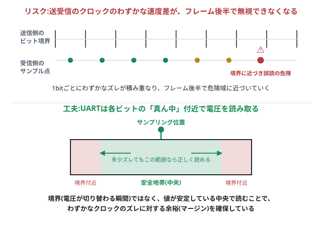

# 第3回 宿題の解答例(指導者用)

> このファイルは指導者向けです。学生には配布せず、次回冒頭の答え合わせの参考にしてください。

## 問い(再掲)

1. UARTはクロック線を使いません。それなのに、送信側と受信側でタイミングがズレずに、1bitずつ正しく読み取れるのはなぜでしょうか。スタートビットの役割からヒントを得て考えてみましょう。
2. 送信側と受信側の内部クロックは、完全に同じ速さとは限りません。もし少しズレていたら、フレームの後半でどんな問題が起きるでしょうか。また、UARTがそれでも安定して読み取れているとしたら、どんな工夫をしていると思いますか。

## 問い1の結論

**「スタートビットの立ち下がりで受信側の内部タイマーをリセットする」＋「送受信で事前に同じボーレートを約束しておく」**の2つの組み合わせで実現しています。クロック線という「共有の合図」が無い代わりに、1フレームが始まるたびに合図をやり直しているイメージです。

## 詳しい説明

1. **待機中(IDLE)は常にHigh**。受信側は「今は何も送られていない」と分かっている状態。
2. **スタートビットの立ち下がり(High→Low)** を受信側が検出すると、「ここから1フレームが始まった」と認識し、自分の内部タイマーを0から数え始める。
3. 送信側・受信側とも、あらかじめ**同じボーレート**(1bitの長さ)を設定してあるので、受信側は「スタートビット検出から1bit分の時間が経過した頃合い」でD0を読み、「2bit分経過した頃合い」でD1を読み…というように、**タイマーだけを頼りに**、クロック線なしで正しいタイミングでサンプリングできる。
4. ストップビットまで読み終えたら、また待機状態に戻り、次のスタートビットを待つ。

つまり、**フレームの先頭(スタートビット)だけで同期を取り直し、あとは決められた速度で数えるだけ**という設計になっています。1フレームは10〜11bit程度と短いため、送信側・受信側のクロックの精度が多少ズレていても、その短い時間内であれば誤差が蓄積しすぎず実用上問題になりません。

ボーレートが送受信で違うと、この「1bit分の頃合い」の見積もりそのものがズレてしまうため、途中から読み取り位置がどんどんズレていき、文字化けが起きます。これは今日の演習5章で実際に体験した現象そのものです。

## 問い1:授業での伝え方の例

- 「スタートビットは、いわば“よーい、ドン!”の合図。ドンの後は、みんな同じpeaceで走るしかない」のような例え話が伝わりやすいです。
- 「クロック線が無いのに、なぜ噛み合うと思う?」と一度考えさせてから、スタートビットの図(波形図)を見返してもらうと、腑に落ちやすいです。

---

## 問い2の結論

**フレームの後半になるほど、送受信のクロック差による誤差が積み重なり、サンプリング位置がビットの境界に近づいて誤読のリスクが高まります。UARTはこれに備え、境界ではなく各ビットの「真ん中」付近で電圧を読み取ることで、誤差に対するマージン(余裕)を確保しています。**

### 詳しい説明

- 送信側・受信側のクロック(発振子)は、製品ごとにごくわずかな個体差がある。両者が完全に同じ速さで動いているとは限らない。
- スタートビットで一度は足並みが揃っても、1bitごとに生まれるごくわずかなズレが、D0→D1→D2…と進むにつれて**累積**していく。図の上段のように、フレーム前半では誤差が小さくても、後半(D6・D7あたり)ではサンプリング位置がビットの境界にかなり近づいてしまうことがある。
- 境界(電圧が切り替わる瞬間)付近でサンプリングしてしまうと、わずかなタイミングのズレだけで「1つ前のビット」や「1つ後のビット」を誤って読んでしまう危険がある。
- そこでUARTの受信回路は、図の下段のように**各ビット区間の中央付近**で電圧を読み取る。ビットの中央は電圧がすでに安定しきっている区間なので、多少タイミングがズレても、正しい値を読み取れる余裕(マージン)がある。
- (発展:実際のUART受信回路の多くは、1bitの区間を16分割程度で内部クロックがオーバーサンプリングし、その中央付近の値を多数決的に採用することで、ノイズにも強くしている。今日はそこまで踏み込まなくてよい。)

### 問い2:授業での伝え方の例

- 「せーの、で走り出した2人の足並みも、100mも走れば少しズレてくる。だからこそ、境界(踏み替えの瞬間)を見るのではなく、歩幅の真ん中(一番安定している瞬間)を見て確認する」のようなたとえが、問い1の「せーの」の話と地続きで伝えやすいです。
- 「なぜ境界ぴったりを読まないんだろう?」と問いかけてから図を見せると、中央サンプリングの合理性が腑に落ちやすいです。

---

## 確認課題3(数字を送る:1byteの壁)の解答例

### 結論

**`count`が256になった瞬間、`bytes([256])`が`ValueError: bytes value out of range`(実装により文言は多少異なる)で止まります。** 1byte(8bit)で表現できる整数の範囲は`0〜255`(2進数で`00000000`〜`11111111`)の256通りしかなく、256はその範囲からあふれてしまうためです。

### 解説

今日の6章で見た通り、UARTの1フレームに乗るデータビットは8bitでした。8bitで表現できるパターンの数は $2^8 = 256$ 通り(0から数えるので、最大値は255)です。`bytes([count])`は「`count`の値を1byteとして詰め込む」処理なので、256以上の値を渡そうとした瞬間に「1byteに収まらない」というエラーになります。

### 授業での伝え方の例

- 「8bitの財布には256種類のコインしか入らない。257種類目を入れようとしたら、財布がパンクする」のようなたとえが伝わりやすいです。
- この壁を体験すると、「では温度や座標のような255を超える値はどうやって送るのか?」という自然な疑問が生まれます。答えは、**1つの値を複数byteに分割して送る**ことです(例えば緯度`33.560789`を`33`,`56`,`07`,`89`のように分けて4byteで送るなど)。この発想は、今後センサの値や画像処理の座標を送信する回で実際に使うことになるので、ここで種をまいておくと後の理解が早くなります。
